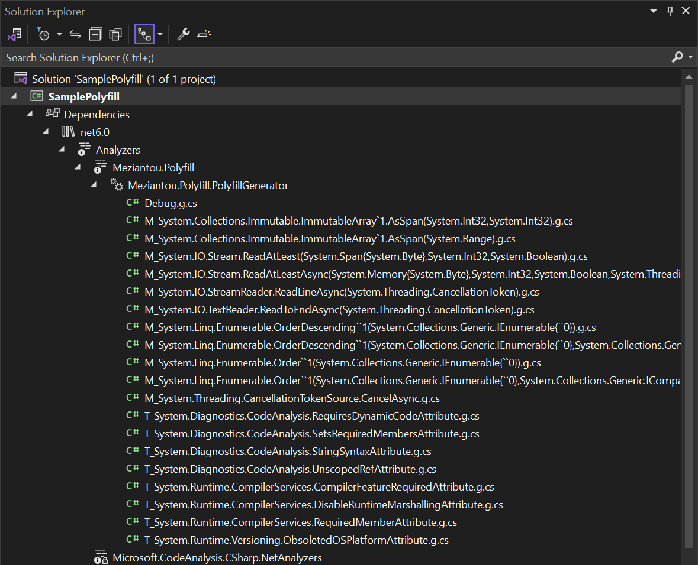

# Meziantou.Polyfill

[](https://www.nuget.org/packages/Meziantou.Polyfill/)

Source Generator that adds polyfill methods and types. This helps working with multi-targeted projects.

Read more about the project: [Polyfills in .NET to ease multi-targeting](https://www.meziantou.net/polyfills-in-dotnet-to-ease-multi-targeting.htm)

## Installation

````bash
dotnet add package Meziantou.Polyfill
````

Then, you should see the generated types in the solution explorer



## Customization

By default, all needed polyfills are generated. You can configure which polyfills should be generated by editing the `.csproj` file and adding the following properties:

````xml
<PropertyGroup>
  <!-- semicolon-separated or pipe-separated list of name prefix -->
  <!-- Tip: The name of the generated polyfills are available in the generated "Debug.g.cs" file -->
  <MeziantouPolyfill_IncludedPolyfills>T:Type1|T:Type2|M:Member1</MeziantouPolyfill_IncludedPolyfills>
  <MeziantouPolyfill_ExcludedPolyfills>M:System.Diagnostics.</MeziantouPolyfill_ExcludedPolyfills>

  <!-- Optional: Output the generated files to the obj\GeneratedFiles folder  -->
  <EmitCompilerGeneratedFiles>True</EmitCompilerGeneratedFiles>
  <CompilerGeneratedFilesOutputPath>$(BaseIntermediateOutputPath)\GeneratedFiles</CompilerGeneratedFilesOutputPath>
</PropertyGroup>
````

## Contribution

#### How to add a new polyfill

- Create a new file named `<xml documentation id>.cs` in the project `Meziantou.Polyfill.Editor`
- Run `Meziantou.Polyfill.Generator`

Notes:
- All files must be self contained. Use a `file class` if needed.
- If you need to generate a file only when another polyfill is generated, add `// when <xml documentation id>` in the file
