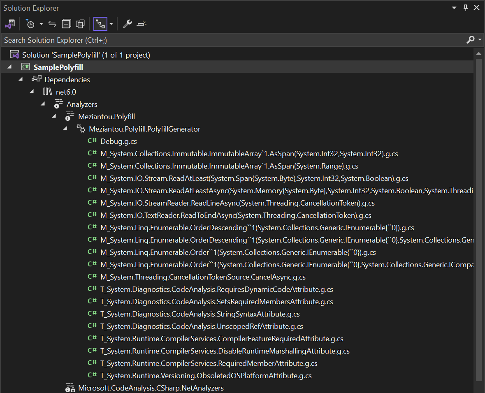

# Meziantou.Polyfill

[](https://www.nuget.org/packages/Meziantou.Polyfill/)

Source Generator that adds polyfill methods and types so projects targeting older TFMs can compile with source-compatible APIs.

Performance is not a goal. If performance is important, target the latest version of .NET. The generated code can still be performant, but it is not fully optimized for all scenarios.

Read more about the project: [Polyfills in .NET to ease multi-targeting](https://www.meziantou.net/polyfills-in-dotnet-to-ease-multi-targeting.htm)

## Installation

````bash
dotnet add package Meziantou.Polyfill
````

Then, you should see the generated types in the solution explorer



## Customization

By default, all needed polyfills are generated. You can configure which polyfills should be generated by editing the `.csproj` file and adding the following properties:

````xml
<PropertyGroup>
  <!-- Opt-in: semicolon-separated or pipe-separated list of name prefixes to include (allowlist) -->
  <!-- When set, ONLY polyfills matching these prefixes will be generated -->
  <!-- Tip: The name of the generated polyfills are available in the generated "Debug.g.cs" file -->
  <MeziantouPolyfill_IncludedPolyfills>T:Type1|T:Type2|M:Member1</MeziantouPolyfill_IncludedPolyfills>

  <!-- Opt-out: semicolon-separated or pipe-separated list of name prefixes to exclude (blocklist) -->
  <!-- Polyfills matching these prefixes will NOT be generated -->
  <MeziantouPolyfill_ExcludedPolyfills>M:System.Diagnostics.</MeziantouPolyfill_ExcludedPolyfills>

  <!-- Optional: Output the generated files to the obj\GeneratedFiles folder  -->
  <EmitCompilerGeneratedFiles>True</EmitCompilerGeneratedFiles>
  <CompilerGeneratedFilesOutputPath>$(BaseIntermediateOutputPath)\GeneratedFiles</CompilerGeneratedFilesOutputPath>
</PropertyGroup>
````

### Filtering Behavior

The filtering logic works as follows:

1. **By default** (neither property set): All polyfills that are not already available in your target framework are generated
2. **MeziantouPolyfill_ExcludedPolyfills** (opt-out/blocklist): Excludes polyfills whose XML documentation ID starts with any of the specified prefixes
3. **MeziantouPolyfill_IncludedPolyfills** (opt-in/allowlist): When set, ONLY includes polyfills whose XML documentation ID starts with any of the specified prefixes
4. **Both properties set**: Exclusions are applied first, then inclusions. A polyfill must match an inclusion filter AND not match any exclusion filter to be generated

## Supported polyfills

<!-- begin_polyfills -->

### Types (84)

- `System.Buffers.SearchValues`
- `System.Buffers.SearchValues<T> where T : System.IEquatable<T>?`
- `System.Buffers.SequenceReader<T> where T : unmanaged, System.IEquatable<T>`
- `System.Buffers.SpanAction<T, in TArg> where TArg : allows ref struct`
- `System.Collections.Generic.KeyValuePair`
- `System.Collections.Generic.PriorityQueue<TElement, TPriority>`
- `System.Collections.Generic.ReferenceEqualityComparer`
- `System.Collections.ObjectModel.ReadOnlySet<T>`
- `System.Diagnostics.CodeAnalysis.AllowNullAttribute`
- `System.Diagnostics.CodeAnalysis.ConstantExpectedAttribute`
- `System.Diagnostics.CodeAnalysis.DisallowNullAttribute`
- `System.Diagnostics.CodeAnalysis.DoesNotReturnAttribute`
- `System.Diagnostics.CodeAnalysis.DoesNotReturnIfAttribute`
- `System.Diagnostics.CodeAnalysis.DynamicDependencyAttribute`
- `System.Diagnostics.CodeAnalysis.DynamicallyAccessedMemberTypes`
- `System.Diagnostics.CodeAnalysis.DynamicallyAccessedMembersAttribute`
- `System.Diagnostics.CodeAnalysis.ExperimentalAttribute`
- `System.Diagnostics.CodeAnalysis.MaybeNullAttribute`
- `System.Diagnostics.CodeAnalysis.MaybeNullWhenAttribute`
- `System.Diagnostics.CodeAnalysis.MemberNotNullAttribute`
- `System.Diagnostics.CodeAnalysis.MemberNotNullWhenAttribute`
- `System.Diagnostics.CodeAnalysis.NotNullAttribute`
- `System.Diagnostics.CodeAnalysis.NotNullIfNotNullAttribute`
- `System.Diagnostics.CodeAnalysis.NotNullWhenAttribute`
- `System.Diagnostics.CodeAnalysis.RequiresAssemblyFilesAttribute`
- `System.Diagnostics.CodeAnalysis.RequiresDynamicCodeAttribute`
- `System.Diagnostics.CodeAnalysis.RequiresUnreferencedCodeAttribute`
- `System.Diagnostics.CodeAnalysis.SetsRequiredMembersAttribute`
- `System.Diagnostics.CodeAnalysis.StringSyntaxAttribute`
- `System.Diagnostics.CodeAnalysis.UnconditionalSuppressMessageAttribute`
- `System.Diagnostics.CodeAnalysis.UnscopedRefAttribute`
- `System.Diagnostics.StackTraceHiddenAttribute`
- `System.Diagnostics.UnreachableException`
- `System.HashCode`
- `System.ITupleInternal`
- `System.Index`
- `System.Net.Http.ReadOnlyMemoryContent`
- `System.Net.Mime.MediaTypeNames.Font`
- `System.Net.Mime.MediaTypeNames.Multipart`
- `System.Range`
- `System.Reflection.NullabilityInfo`
- `System.Reflection.NullabilityInfoContext`
- `System.Reflection.NullabilityState`
- `System.Runtime.CompilerServices.AsyncMethodBuilderAttribute`
- `System.Runtime.CompilerServices.CallerArgumentExpressionAttribute`
- `System.Runtime.CompilerServices.CollectionBuilderAttribute`
- `System.Runtime.CompilerServices.CompilerFeatureRequiredAttribute`
- `System.Runtime.CompilerServices.DefaultInterpolatedStringHandler`
- `System.Runtime.CompilerServices.DisableRuntimeMarshallingAttribute`
- `System.Runtime.CompilerServices.IUnion`
- `System.Runtime.CompilerServices.InterpolatedStringHandlerArgumentAttribute`
- `System.Runtime.CompilerServices.InterpolatedStringHandlerAttribute`
- `System.Runtime.CompilerServices.IsExternalInit`
- `System.Runtime.CompilerServices.ModuleInitializerAttribute`
- `System.Runtime.CompilerServices.OverloadResolutionPriorityAttribute`
- `System.Runtime.CompilerServices.RequiredMemberAttribute`
- `System.Runtime.CompilerServices.SkipLocalsInitAttribute`
- `System.Runtime.CompilerServices.TupleElementNamesAttribute`
- `System.Runtime.CompilerServices.UnionAttribute`
- `System.Runtime.InteropServices.ExtendedLayoutAttribute`
- `System.Runtime.InteropServices.ExtendedLayoutKind`
- `System.Runtime.InteropServices.SuppressGCTransitionAttribute`
- `System.Runtime.InteropServices.UnmanagedCallersOnlyAttribute`
- `System.Runtime.Versioning.ObsoletedOSPlatformAttribute`
- `System.Runtime.Versioning.RequiresPreviewFeaturesAttribute`
- `System.Runtime.Versioning.SupportedOSPlatformAttribute`
- `System.Runtime.Versioning.SupportedOSPlatformGuardAttribute`
- `System.Runtime.Versioning.TargetPlatformAttribute`
- `System.Runtime.Versioning.UnsupportedOSPlatformAttribute`
- `System.Runtime.Versioning.UnsupportedOSPlatformGuardAttribute`
- `System.Threading.ITimer`
- `System.Threading.Lock`
- `System.Threading.PeriodicTimer`
- `System.Threading.Tasks.TaskToAsyncResult`
- `System.TimeProvider`
- `System.ValueTuple`
- `System.ValueTuple<T1>`
- `System.ValueTuple<T1, T2>`
- `System.ValueTuple<T1, T2, T3>`
- `System.ValueTuple<T1, T2, T3, T4>`
- `System.ValueTuple<T1, T2, T3, T4, T5>`
- `System.ValueTuple<T1, T2, T3, T4, T5, T6>`
- `System.ValueTuple<T1, T2, T3, T4, T5, T6, T7>`
- `System.ValueTuple<T1, T2, T3, T4, T5, T6, T7, TRest> where TRest : struct`

### Methods (933)

- `System.ArgumentException.ThrowIfNullOrEmpty(System.String? argument, [System.String? paramName = null])`
- `System.ArgumentException.ThrowIfNullOrWhiteSpace(System.String? argument, [System.String? paramName = null])`
- `System.ArgumentNullException.ThrowIfNull(System.Object? argument, [System.String? paramName = null])`
- `System.ArgumentNullException.ThrowIfNull(System.Void* argument, [System.String? paramName = null])`
- `System.ArgumentOutOfRangeException.ThrowIfEqual<T>(T value, T other, [System.String? paramName = null])`
- `System.ArgumentOutOfRangeException.ThrowIfGreaterThanOrEqual<T>(T value, T other, [System.String? paramName = null]) where T : System.IComparable<T>`
- `System.ArgumentOutOfRangeException.ThrowIfGreaterThan<T>(T value, T other, [System.String? paramName = null]) where T : System.IComparable<T>`
- `System.ArgumentOutOfRangeException.ThrowIfLessThanOrEqual<T>(T value, T other, [System.String? paramName = null]) where T : System.IComparable<T>`
- `System.ArgumentOutOfRangeException.ThrowIfLessThan<T>(T value, T other, [System.String? paramName = null]) where T : System.IComparable<T>`
- `System.ArgumentOutOfRangeException.ThrowIfNegativeOrZero<T>(T value, [System.String? paramName = null]) where T : System.Numerics.INumberBase<T>`
- `System.ArgumentOutOfRangeException.ThrowIfNegative<T>(T value, [System.String? paramName = null]) where T : System.Numerics.INumberBase<T>`
- `System.ArgumentOutOfRangeException.ThrowIfNotEqual<T>(T value, T other, [System.String? paramName = null])`
- `System.ArgumentOutOfRangeException.ThrowIfZero<T>(T value, [System.String? paramName = null]) where T : System.Numerics.INumberBase<T>`
- `System.Array.Fill<T>(T[] array, T value)`
- `System.Array.Fill<T>(T[] array, T value, System.Int32 startIndex, System.Int32 count)`
- `System.ArraySegment<T>.CopyTo(System.ArraySegment<T> destination)`
- `System.ArraySegment<T>.CopyTo(T[] destination)`
- `System.ArraySegment<T>.CopyTo(T[] destination, System.Int32 destinationIndex)`
- `System.ArraySegment<T>.GetEnumerator()`
- `System.BitConverter.DoubleToUInt64Bits(System.Double value)`
- `System.BitConverter.ToInt16(System.ReadOnlySpan<System.Byte> value)`
- `System.BitConverter.ToInt32(System.ReadOnlySpan<System.Byte> value)`
- `System.BitConverter.ToUInt16(System.ReadOnlySpan<System.Byte> value)`
- `System.BitConverter.ToUInt32(System.ReadOnlySpan<System.Byte> value)`
- `System.BitConverter.UInt32BitsToSingle(System.UInt32 value)`
- `System.BitConverter.UInt64BitsToDouble(System.UInt64 value)`
- `System.Boolean.TryFormat(System.Span<System.Char> destination, out System.Int32 charsWritten)`
- `System.Buffers.Binary.BinaryPrimitives.ReadDoubleBigEndian(System.ReadOnlySpan<System.Byte> source)`
- `System.Buffers.Binary.BinaryPrimitives.ReadDoubleLittleEndian(System.ReadOnlySpan<System.Byte> source)`
- `System.Buffers.Binary.BinaryPrimitives.ReadSingleBigEndian(System.ReadOnlySpan<System.Byte> source)`
- `System.Buffers.Binary.BinaryPrimitives.ReadSingleLittleEndian(System.ReadOnlySpan<System.Byte> source)`
- `System.Buffers.Binary.BinaryPrimitives.TryReadDoubleBigEndian(System.ReadOnlySpan<System.Byte> source, out System.Double value)`
- `System.Buffers.Binary.BinaryPrimitives.TryReadDoubleLittleEndian(System.ReadOnlySpan<System.Byte> source, out System.Double value)`
- `System.Buffers.Binary.BinaryPrimitives.TryReadSingleBigEndian(System.ReadOnlySpan<System.Byte> source, out System.Single value)`
- `System.Buffers.Binary.BinaryPrimitives.TryReadSingleLittleEndian(System.ReadOnlySpan<System.Byte> source, out System.Single value)`
- `System.Buffers.Binary.BinaryPrimitives.TryWriteDoubleBigEndian(System.Span<System.Byte> destination, System.Double value)`
- `System.Buffers.Binary.BinaryPrimitives.TryWriteDoubleLittleEndian(System.Span<System.Byte> destination, System.Double value)`
- `System.Buffers.Binary.BinaryPrimitives.TryWriteSingleBigEndian(System.Span<System.Byte> destination, System.Single value)`
- `System.Buffers.Binary.BinaryPrimitives.TryWriteSingleLittleEndian(System.Span<System.Byte> destination, System.Single value)`
- `System.Buffers.Binary.BinaryPrimitives.WriteDoubleBigEndian(System.Span<System.Byte> destination, System.Double value)`
- `System.Buffers.Binary.BinaryPrimitives.WriteDoubleLittleEndian(System.Span<System.Byte> destination, System.Double value)`
- `System.Buffers.Binary.BinaryPrimitives.WriteSingleBigEndian(System.Span<System.Byte> destination, System.Single value)`
- `System.Buffers.Binary.BinaryPrimitives.WriteSingleLittleEndian(System.Span<System.Byte> destination, System.Single value)`
- `System.Buffers.SearchValues.Create(System.ReadOnlySpan<System.Byte> values)`
- `System.Buffers.SearchValues.Create(System.ReadOnlySpan<System.Char> values)`
- `System.Buffers.SearchValues.Create(System.ReadOnlySpan<System.String> values, System.StringComparison comparisonType)`
- `System.Buffers.SearchValues.Create<T>(System.ReadOnlySpan<T> values) where T : System.IEquatable<T>?`
- `System.Buffers.SearchValues<T>.Contains(T value)`
- `System.Buffers.SequenceReader<T>.Advance(System.Int32 count)`
- `System.Buffers.SequenceReader<T>.Advance(System.Int64 count)`
- `System.Buffers.SequenceReader<T>.Rewind(System.Int64 count)`
- `readonly System.Buffers.SequenceReader<T>.TryCopyTo(System.Span<T> destination)`
- `readonly System.Buffers.SequenceReader<T>.TryPeek(System.Int64 offset, out T value)`
- `readonly System.Buffers.SequenceReader<T>.TryPeek(out T value)`
- `System.Buffers.SequenceReader<T>.TryRead(out T value)`
- `System.Byte.Parse(System.ReadOnlySpan<System.Byte> utf8Text, [System.Globalization.NumberStyles style = System.Globalization.NumberStyles.Integer], [System.IFormatProvider? provider = null])`
- `System.Byte.Parse(System.ReadOnlySpan<System.Byte> utf8Text, System.IFormatProvider? provider)`
- `System.Byte.Parse(System.ReadOnlySpan<System.Char> s, [System.Globalization.NumberStyles style = System.Globalization.NumberStyles.Integer], [System.IFormatProvider? provider = null])`
- `System.Byte.Parse(System.ReadOnlySpan<System.Char> s, System.IFormatProvider? provider)`
- `System.Byte.TryFormat(System.Span<System.Byte> utf8Destination, out System.Int32 bytesWritten, [System.ReadOnlySpan<System.Char> format = default], [System.IFormatProvider? provider = null])`
- `System.Byte.TryFormat(System.Span<System.Char> destination, out System.Int32 charsWritten, [System.ReadOnlySpan<System.Char> format = default], [System.IFormatProvider? provider = null])`
- `System.Byte.TryParse(System.ReadOnlySpan<System.Byte> utf8Text, out System.Byte result)`
- `System.Byte.TryParse(System.ReadOnlySpan<System.Byte> utf8Text, System.Globalization.NumberStyles style, System.IFormatProvider? provider, out System.Byte result)`
- `System.Byte.TryParse(System.ReadOnlySpan<System.Byte> utf8Text, System.IFormatProvider? provider, out System.Byte result)`
- `System.Byte.TryParse(System.ReadOnlySpan<System.Char> s, out System.Byte result)`
- `System.Byte.TryParse(System.ReadOnlySpan<System.Char> s, System.Globalization.NumberStyles style, System.IFormatProvider? provider, out System.Byte result)`
- `System.Byte.TryParse(System.ReadOnlySpan<System.Char> s, System.IFormatProvider? provider, out System.Byte result)`
- `System.Byte.TryParse(System.String? s, System.IFormatProvider? provider, out System.Byte result)`
- `System.Char.Equals(System.Char other, System.StringComparison comparisonType)`
- `System.Char.IsAscii(System.Char c)`
- `System.Char.IsAsciiDigit(System.Char c)`
- `System.Char.IsAsciiHexDigit(System.Char c)`
- `System.Char.IsAsciiHexDigitLower(System.Char c)`
- `System.Char.IsAsciiHexDigitUpper(System.Char c)`
- `System.Char.IsAsciiLetter(System.Char c)`
- `System.Char.IsAsciiLetterLower(System.Char c)`
- `System.Char.IsAsciiLetterOrDigit(System.Char c)`
- `System.Char.IsAsciiLetterUpper(System.Char c)`
- `System.Char.IsBetween(System.Char c, System.Char minInclusive, System.Char maxInclusive)`
- `System.Collections.Concurrent.ConcurrentBag<T>.Clear()`
- `System.Collections.Concurrent.ConcurrentDictionary<TKey, TValue>.GetOrAdd<TArg>(TKey key, System.Func<TKey, TArg, TValue> valueFactory, TArg factoryArgument) where TArg : allows ref struct`
- `System.Collections.Concurrent.ConcurrentQueue<T>.Clear()`
- `System.Collections.DictionaryEntry.Deconstruct(out System.Object key, out System.Object? value)`
- `System.Collections.Generic.CollectionExtensions.AddRange<T>(this System.Collections.Generic.List<T> list, params System.ReadOnlySpan<T> source)`
- `System.Collections.Generic.CollectionExtensions.AsReadOnly<T>(this System.Collections.Generic.IList<T> list)`
- `System.Collections.Generic.CollectionExtensions.AsReadOnly<T>(this System.Collections.Generic.ISet<T> set)`
- `System.Collections.Generic.CollectionExtensions.AsReadOnly<TKey, TValue>(this System.Collections.Generic.IDictionary<TKey, TValue> dictionary) where TKey : notnull`
- `System.Collections.Generic.CollectionExtensions.CopyTo<T>(this System.Collections.Generic.List<T> list, System.Span<T> destination)`
- `System.Collections.Generic.CollectionExtensions.GetValueOrDefault<TKey, TValue>(this System.Collections.Generic.IReadOnlyDictionary<TKey, TValue> dictionary, TKey key)`
- `System.Collections.Generic.CollectionExtensions.GetValueOrDefault<TKey, TValue>(this System.Collections.Generic.IReadOnlyDictionary<TKey, TValue> dictionary, TKey key, TValue defaultValue)`
- `System.Collections.Generic.CollectionExtensions.InsertRange<T>(this System.Collections.Generic.List<T> list, System.Int32 index, params System.ReadOnlySpan<T> source)`
- `System.Collections.Generic.CollectionExtensions.Remove<TKey, TValue>(this System.Collections.Generic.IDictionary<TKey, TValue> dictionary, TKey key, out TValue value)`
- `System.Collections.Generic.CollectionExtensions.TryAdd<TKey, TValue>(this System.Collections.Generic.IDictionary<TKey, TValue> dictionary, TKey key, TValue value)`
- `System.Collections.Generic.Dictionary<TKey, TValue>.Remove(TKey key, out TValue value)`
- `System.Collections.Generic.Dictionary<TKey, TValue>.TryAdd(TKey key, TValue value)`
- `System.Collections.Generic.EqualityComparer<T>.Create(System.Func<T?, T?, System.Boolean> equals, [System.Func<T, System.Int32>? getHashCode = null])`
- `System.Collections.Generic.KeyValuePair.Create<TKey, TValue>(TKey key, TValue value)`
- `System.Collections.Generic.KeyValuePair<TKey, TValue>.Deconstruct(out TKey key, out TValue value)`
- `System.Collections.Generic.List<T>.Slice(System.Int32 start, System.Int32 length)`
- `System.Collections.Generic.PriorityQueue<TElement, TPriority>.Clear()`
- `System.Collections.Generic.PriorityQueue<TElement, TPriority>.DequeueEnqueue(TElement element, TPriority priority)`
- `System.Collections.Generic.PriorityQueue<TElement, TPriority>.Dequeue()`
- `System.Collections.Generic.PriorityQueue<TElement, TPriority>.Enqueue(TElement element, TPriority priority)`
- `System.Collections.Generic.PriorityQueue<TElement, TPriority>.EnqueueDequeue(TElement element, TPriority priority)`
- `System.Collections.Generic.PriorityQueue<TElement, TPriority>.EnqueueRange(System.Collections.Generic.IEnumerable<System.ValueTuple<TElement, TPriority>> items)`
- `System.Collections.Generic.PriorityQueue<TElement, TPriority>.EnqueueRange(System.Collections.Generic.IEnumerable<TElement> elements, TPriority priority)`
- `System.Collections.Generic.PriorityQueue<TElement, TPriority>.EnsureCapacity(System.Int32 capacity)`
- `System.Collections.Generic.PriorityQueue<TElement, TPriority>.Peek()`
- `System.Collections.Generic.PriorityQueue<TElement, TPriority>.TrimExcess()`
- `System.Collections.Generic.PriorityQueue<TElement, TPriority>.TryDequeue(out TElement element, out TPriority priority)`
- `System.Collections.Generic.PriorityQueue<TElement, TPriority>.TryPeek(out TElement element, out TPriority priority)`
- `System.Collections.Generic.Queue<T>.TryDequeue(out T result)`
- `System.Collections.Generic.ReferenceEqualityComparer.Equals(System.Object? x, System.Object? y)`
- `System.Collections.Generic.ReferenceEqualityComparer.GetHashCode(System.Object? obj)`
- `System.Collections.Generic.SortedList<TKey, TValue>.GetKeyAtIndex(System.Int32 index)`
- `System.Collections.Generic.SortedList<TKey, TValue>.GetValueAtIndex(System.Int32 index)`
- `System.Collections.Generic.Stack<T>.TryPeek(out T result)`
- `System.Collections.Generic.Stack<T>.TryPop(out T result)`
- `System.Collections.Immutable.ImmutableArray<T>.AsSpan()`
- `System.Collections.Immutable.ImmutableArray<T>.AsSpan(System.Int32 start, System.Int32 length)`
- `System.Collections.Immutable.ImmutableArray<T>.AsSpan(System.Range range)`
- `System.Collections.ObjectModel.ReadOnlySet<T>.Contains(T item)`
- `System.Collections.ObjectModel.ReadOnlySet<T>.CopyTo(T[] array, System.Int32 arrayIndex)`
- `System.Collections.ObjectModel.ReadOnlySet<T>.GetEnumerator()`
- `System.Collections.ObjectModel.ReadOnlySet<T>.IsProperSubsetOf(System.Collections.Generic.IEnumerable<T> other)`
- `System.Collections.ObjectModel.ReadOnlySet<T>.IsProperSupersetOf(System.Collections.Generic.IEnumerable<T> other)`
- `System.Collections.ObjectModel.ReadOnlySet<T>.IsSubsetOf(System.Collections.Generic.IEnumerable<T> other)`
- `System.Collections.ObjectModel.ReadOnlySet<T>.IsSupersetOf(System.Collections.Generic.IEnumerable<T> other)`
- `System.Collections.ObjectModel.ReadOnlySet<T>.Overlaps(System.Collections.Generic.IEnumerable<T> other)`
- `System.Collections.ObjectModel.ReadOnlySet<T>.SetEquals(System.Collections.Generic.IEnumerable<T> other)`
- `System.Console.OpenStandardErrorHandle()`
- `System.Console.OpenStandardInputHandle()`
- `System.Console.OpenStandardOutputHandle()`
- `System.Convert.FromHexString(System.ReadOnlySpan<System.Byte> utf8Source)`
- `System.Convert.FromHexString(System.ReadOnlySpan<System.Byte> utf8Source, System.Span<System.Byte> destination, out System.Int32 bytesConsumed, out System.Int32 bytesWritten)`
- `System.Convert.FromHexString(System.ReadOnlySpan<System.Char> chars)`
- `System.Convert.FromHexString(System.ReadOnlySpan<System.Char> source, System.Span<System.Byte> destination, out System.Int32 charsConsumed, out System.Int32 bytesWritten)`
- `System.Convert.FromHexString(System.String s)`
- `System.Convert.FromHexString(System.String source, System.Span<System.Byte> destination, out System.Int32 charsConsumed, out System.Int32 bytesWritten)`
- `System.Convert.ToBase64String(System.ReadOnlySpan<System.Byte> bytes, [System.Base64FormattingOptions options = System.Base64FormattingOptions.None])`
- `System.Convert.ToHexString(System.Byte[] inArray)`
- `System.Convert.ToHexString(System.Byte[] inArray, System.Int32 offset, System.Int32 length)`
- `System.Convert.ToHexString(System.ReadOnlySpan<System.Byte> bytes)`
- `System.Convert.ToHexStringLower(System.Byte[] inArray)`
- `System.Convert.ToHexStringLower(System.Byte[] inArray, System.Int32 offset, System.Int32 length)`
- `System.Convert.ToHexStringLower(System.ReadOnlySpan<System.Byte> bytes)`
- `System.Convert.TryFromBase64Chars(System.ReadOnlySpan<System.Char> chars, System.Span<System.Byte> bytes, out System.Int32 bytesWritten)`
- `System.Convert.TryFromBase64String(System.String s, System.Span<System.Byte> bytes, out System.Int32 bytesWritten)`
- `System.Convert.TryToBase64Chars(System.ReadOnlySpan<System.Byte> bytes, System.Span<System.Char> chars, out System.Int32 charsWritten, [System.Base64FormattingOptions options = System.Base64FormattingOptions.None])`
- `System.Convert.TryToHexString(System.ReadOnlySpan<System.Byte> source, System.Span<System.Byte> utf8Destination, out System.Int32 bytesWritten)`
- `System.Convert.TryToHexString(System.ReadOnlySpan<System.Byte> source, System.Span<System.Char> destination, out System.Int32 charsWritten)`
- `System.Convert.TryToHexStringLower(System.ReadOnlySpan<System.Byte> source, System.Span<System.Byte> utf8Destination, out System.Int32 bytesWritten)`
- `System.Convert.TryToHexStringLower(System.ReadOnlySpan<System.Byte> source, System.Span<System.Char> destination, out System.Int32 charsWritten)`
- `System.DateOnly.Deconstruct(out System.Int32 year, out System.Int32 month, out System.Int32 day)`
- `System.DateOnly.TryFormat(System.Span<System.Byte> utf8Destination, out System.Int32 bytesWritten, [System.ReadOnlySpan<System.Char> format = default], [System.IFormatProvider? provider = null])`
- `System.DateOnly.TryFormat(System.Span<System.Char> destination, out System.Int32 charsWritten, [System.ReadOnlySpan<System.Char> format = default], [System.IFormatProvider? provider = null])`
- `System.DateTime.AddMicroseconds(System.Double value)`
- `System.DateTime.Deconstruct(out System.DateOnly date, out System.TimeOnly time)`
- `System.DateTime.Deconstruct(out System.Int32 year, out System.Int32 month, out System.Int32 day)`
- `System.DateTime.TryFormat(System.Span<System.Byte> utf8Destination, out System.Int32 bytesWritten, [System.ReadOnlySpan<System.Char> format = default], [System.IFormatProvider? provider = null])`
- `System.DateTime.TryFormat(System.Span<System.Char> destination, out System.Int32 charsWritten, [System.ReadOnlySpan<System.Char> format = default], [System.IFormatProvider? provider = null])`
- `System.DateTime.TryParse(System.ReadOnlySpan<System.Char> s, out System.DateTime result)`
- `System.DateTime.TryParse(System.ReadOnlySpan<System.Char> s, System.IFormatProvider? provider, out System.DateTime result)`
- `System.DateTime.TryParse(System.ReadOnlySpan<System.Char> s, System.IFormatProvider? provider, System.Globalization.DateTimeStyles styles, out System.DateTime result)`
- `System.DateTime.TryParse(System.String? s, System.IFormatProvider? provider, out System.DateTime result)`
- `System.DateTime.TryParseExact(System.ReadOnlySpan<System.Char> s, System.ReadOnlySpan<System.Char> format, System.IFormatProvider? provider, System.Globalization.DateTimeStyles style, out System.DateTime result)`
- `System.DateTimeOffset.AddMicroseconds(System.Double microseconds)`
- `System.DateTimeOffset.Deconstruct(out System.DateOnly date, out System.TimeOnly time, out System.TimeSpan offset)`
- `System.DateTimeOffset.TryFormat(System.Span<System.Byte> utf8Destination, out System.Int32 bytesWritten, [System.ReadOnlySpan<System.Char> format = default], [System.IFormatProvider? formatProvider = null])`
- `System.DateTimeOffset.TryFormat(System.Span<System.Char> destination, out System.Int32 charsWritten, [System.ReadOnlySpan<System.Char> format = default], [System.IFormatProvider? formatProvider = null])`
- `System.DateTimeOffset.TryParse(System.ReadOnlySpan<System.Char> input, out System.DateTimeOffset result)`
- `System.DateTimeOffset.TryParse(System.ReadOnlySpan<System.Char> s, System.IFormatProvider? provider, out System.DateTimeOffset result)`
- `System.DateTimeOffset.TryParse(System.ReadOnlySpan<System.Char> input, System.IFormatProvider? formatProvider, System.Globalization.DateTimeStyles styles, out System.DateTimeOffset result)`
- `System.DateTimeOffset.TryParse(System.String? s, System.IFormatProvider? provider, out System.DateTimeOffset result)`
- `System.DateTimeOffset.TryParseExact(System.ReadOnlySpan<System.Char> input, System.ReadOnlySpan<System.Char> format, System.IFormatProvider? formatProvider, System.Globalization.DateTimeStyles styles, out System.DateTimeOffset result)`
- `System.Decimal.Parse(System.ReadOnlySpan<System.Byte> utf8Text, [System.Globalization.NumberStyles style = System.Globalization.NumberStyles.Number], [System.IFormatProvider? provider = null])`
- `System.Decimal.Parse(System.ReadOnlySpan<System.Byte> utf8Text, System.IFormatProvider? provider)`
- `System.Decimal.Parse(System.ReadOnlySpan<System.Char> s, [System.Globalization.NumberStyles style = System.Globalization.NumberStyles.Number], [System.IFormatProvider? provider = null])`
- `System.Decimal.Parse(System.ReadOnlySpan<System.Char> s, System.IFormatProvider? provider)`
- `System.Decimal.TryFormat(System.Span<System.Byte> utf8Destination, out System.Int32 bytesWritten, [System.ReadOnlySpan<System.Char> format = default], [System.IFormatProvider? provider = null])`
- `System.Decimal.TryFormat(System.Span<System.Char> destination, out System.Int32 charsWritten, [System.ReadOnlySpan<System.Char> format = default], [System.IFormatProvider? provider = null])`
- `System.Decimal.TryParse(System.ReadOnlySpan<System.Byte> utf8Text, out System.Decimal result)`
- `System.Decimal.TryParse(System.ReadOnlySpan<System.Byte> utf8Text, System.Globalization.NumberStyles style, System.IFormatProvider? provider, out System.Decimal result)`
- `System.Decimal.TryParse(System.ReadOnlySpan<System.Byte> utf8Text, System.IFormatProvider? provider, out System.Decimal result)`
- `System.Decimal.TryParse(System.ReadOnlySpan<System.Char> s, out System.Decimal result)`
- `System.Decimal.TryParse(System.ReadOnlySpan<System.Char> s, System.Globalization.NumberStyles style, System.IFormatProvider? provider, out System.Decimal result)`
- `System.Decimal.TryParse(System.ReadOnlySpan<System.Char> s, System.IFormatProvider? provider, out System.Decimal result)`
- `System.Decimal.TryParse(System.String? s, System.IFormatProvider? provider, out System.Decimal result)`
- `System.Delegate.EnumerateInvocationList<TDelegate>(TDelegate? d) where TDelegate : System.Delegate`
- `System.Diagnostics.Process.WaitForExitAsync([System.Threading.CancellationToken cancellationToken = default])`
- `System.Diagnostics.Stopwatch.GetElapsedTime(System.Int64 startingTimestamp)`
- `System.Diagnostics.Stopwatch.GetElapsedTime(System.Int64 startingTimestamp, System.Int64 endingTimestamp)`
- `System.Double.Parse(System.ReadOnlySpan<System.Byte> utf8Text, [System.Globalization.NumberStyles style = System.Globalization.NumberStyles.AllowThousands | System.Globalization.NumberStyles.Float], [System.IFormatProvider? provider = null])`
- `System.Double.Parse(System.ReadOnlySpan<System.Byte> utf8Text, System.IFormatProvider? provider)`
- `System.Double.Parse(System.ReadOnlySpan<System.Char> s, [System.Globalization.NumberStyles style = System.Globalization.NumberStyles.AllowThousands | System.Globalization.NumberStyles.Float], [System.IFormatProvider? provider = null])`
- `System.Double.Parse(System.ReadOnlySpan<System.Char> s, System.IFormatProvider? provider)`
- `System.Double.TryFormat(System.Span<System.Byte> utf8Destination, out System.Int32 bytesWritten, [System.ReadOnlySpan<System.Char> format = default], [System.IFormatProvider? provider = null])`
- `System.Double.TryFormat(System.Span<System.Char> destination, out System.Int32 charsWritten, [System.ReadOnlySpan<System.Char> format = default], [System.IFormatProvider? provider = null])`
- `System.Double.TryParse(System.ReadOnlySpan<System.Byte> utf8Text, out System.Double result)`
- `System.Double.TryParse(System.ReadOnlySpan<System.Byte> utf8Text, System.Globalization.NumberStyles style, System.IFormatProvider? provider, out System.Double result)`
- `System.Double.TryParse(System.ReadOnlySpan<System.Byte> utf8Text, System.IFormatProvider? provider, out System.Double result)`
- `System.Double.TryParse(System.ReadOnlySpan<System.Char> s, out System.Double result)`
- `System.Double.TryParse(System.ReadOnlySpan<System.Char> s, System.Globalization.NumberStyles style, System.IFormatProvider? provider, out System.Double result)`
- `System.Double.TryParse(System.ReadOnlySpan<System.Char> s, System.IFormatProvider? provider, out System.Double result)`
- `System.Enum.GetNames<TEnum>() where TEnum : struct, System.Enum`
- `System.Enum.GetValues<TEnum>() where TEnum : struct, System.Enum`
- `System.Enum.IsDefined<TEnum>(TEnum value) where TEnum : struct, System.Enum`
- `System.Enum.Parse<TEnum>(System.ReadOnlySpan<System.Char> value) where TEnum : struct`
- `System.Enum.Parse<TEnum>(System.ReadOnlySpan<System.Char> value, System.Boolean ignoreCase) where TEnum : struct`
- `System.Enum.Parse<TEnum>(System.String value) where TEnum : struct`
- `System.Enum.Parse<TEnum>(System.String value, System.Boolean ignoreCase) where TEnum : struct`
- `System.Enum.TryParse(System.Type enumType, System.ReadOnlySpan<System.Char> value, System.Boolean ignoreCase, out System.Object? result)`
- `System.Enum.TryParse(System.Type enumType, System.ReadOnlySpan<System.Char> value, out System.Object? result)`
- `System.Enum.TryParse(System.Type enumType, System.String? value, System.Boolean ignoreCase, out System.Object? result)`
- `System.Enum.TryParse(System.Type enumType, System.String? value, out System.Object? result)`
- `System.Enum.TryParse<TEnum>(System.ReadOnlySpan<System.Char> value, System.Boolean ignoreCase, out TEnum result) where TEnum : struct`
- `System.Enum.TryParse<TEnum>(System.ReadOnlySpan<System.Char> value, out TEnum result) where TEnum : struct`
- `System.Enum.TryParse<TEnum>(System.String? value, System.Boolean ignoreCase, out TEnum result) where TEnum : struct`
- `System.Enum.TryParse<TEnum>(System.String? value, out TEnum result) where TEnum : struct`
- `System.GC.AllocateUninitializedArray<T>(System.Int32 length, [System.Boolean pinned = false])`
- `System.Guid.CreateVersion7()`
- `System.Guid.CreateVersion7(System.DateTimeOffset timestamp)`
- `System.Guid.Parse(System.ReadOnlySpan<System.Byte> utf8Text)`
- `System.Guid.TryFormat(System.Span<System.Byte> utf8Destination, out System.Int32 bytesWritten, [System.ReadOnlySpan<System.Char> format = default])`
- `System.Guid.TryFormat(System.Span<System.Char> destination, out System.Int32 charsWritten, [System.ReadOnlySpan<System.Char> format = default])`
- `System.Guid.TryParse(System.ReadOnlySpan<System.Byte> utf8Text, out System.Guid result)`
- `System.Guid.TryParse(System.ReadOnlySpan<System.Char> input, out System.Guid result)`
- `System.Guid.TryParse(System.ReadOnlySpan<System.Char> s, System.IFormatProvider? provider, out System.Guid result)`
- `System.Guid.TryParse(System.String? s, System.IFormatProvider? provider, out System.Guid result)`
- `System.Guid.TryParseExact(System.ReadOnlySpan<System.Char> input, System.ReadOnlySpan<System.Char> format, out System.Guid result)`
- `System.HashCode.Add<T>(T value)`
- `System.HashCode.Add<T>(T value, System.Collections.Generic.IEqualityComparer<T>? comparer)`
- `System.HashCode.Combine<T1>(T1 value1)`
- `System.HashCode.Combine<T1, T2>(T1 value1, T2 value2)`
- `System.HashCode.Combine<T1, T2, T3>(T1 value1, T2 value2, T3 value3)`
- `System.HashCode.Combine<T1, T2, T3, T4>(T1 value1, T2 value2, T3 value3, T4 value4)`
- `System.HashCode.Combine<T1, T2, T3, T4, T5>(T1 value1, T2 value2, T3 value3, T4 value4, T5 value5)`
- `System.HashCode.Combine<T1, T2, T3, T4, T5, T6>(T1 value1, T2 value2, T3 value3, T4 value4, T5 value5, T6 value6)`
- `System.HashCode.Combine<T1, T2, T3, T4, T5, T6, T7>(T1 value1, T2 value2, T3 value3, T4 value4, T5 value5, T6 value6, T7 value7)`
- `System.HashCode.Combine<T1, T2, T3, T4, T5, T6, T7, T8>(T1 value1, T2 value2, T3 value3, T4 value4, T5 value5, T6 value6, T7 value7, T8 value8)`
- `System.HashCode.Equals(System.Object? obj)`
- `System.HashCode.GetHashCode()`
- `System.HashCode.ToHashCode()`
- `System.IO.File.AppendAllBytes(System.String path, System.Byte[] bytes)`
- `System.IO.File.AppendAllBytes(System.String path, System.ReadOnlySpan<System.Byte> bytes)`
- `System.IO.File.AppendAllBytesAsync(System.String path, System.Byte[] bytes, [System.Threading.CancellationToken cancellationToken = default])`
- `System.IO.File.AppendAllBytesAsync(System.String path, System.ReadOnlyMemory<System.Byte> bytes, [System.Threading.CancellationToken cancellationToken = default])`
- `System.IO.File.AppendAllLinesAsync(System.String path, System.Collections.Generic.IEnumerable<System.String> contents, System.Text.Encoding encoding, [System.Threading.CancellationToken cancellationToken = default])`
- `System.IO.File.AppendAllLinesAsync(System.String path, System.Collections.Generic.IEnumerable<System.String> contents, [System.Threading.CancellationToken cancellationToken = default])`
- `System.IO.File.AppendAllText(System.String path, System.ReadOnlySpan<System.Char> contents)`
- `System.IO.File.AppendAllText(System.String path, System.ReadOnlySpan<System.Char> contents, System.Text.Encoding encoding)`
- `System.IO.File.AppendAllTextAsync(System.String path, System.ReadOnlyMemory<System.Char> contents, System.Text.Encoding encoding, [System.Threading.CancellationToken cancellationToken = default])`
- `System.IO.File.AppendAllTextAsync(System.String path, System.ReadOnlyMemory<System.Char> contents, [System.Threading.CancellationToken cancellationToken = default])`
- `System.IO.File.AppendAllTextAsync(System.String path, System.String? contents, System.Text.Encoding encoding, [System.Threading.CancellationToken cancellationToken = default])`
- `System.IO.File.AppendAllTextAsync(System.String path, System.String? contents, [System.Threading.CancellationToken cancellationToken = default])`
- `System.IO.File.Move(System.String sourceFileName, System.String destFileName, System.Boolean overwrite)`
- `System.IO.File.ReadAllBytesAsync(System.String path, [System.Threading.CancellationToken cancellationToken = default])`
- `System.IO.File.ReadAllLinesAsync(System.String path, System.Text.Encoding encoding, [System.Threading.CancellationToken cancellationToken = default])`
- `System.IO.File.ReadAllLinesAsync(System.String path, [System.Threading.CancellationToken cancellationToken = default])`
- `System.IO.File.ReadAllTextAsync(System.String path, System.Text.Encoding encoding, [System.Threading.CancellationToken cancellationToken = default])`
- `System.IO.File.ReadAllTextAsync(System.String path, [System.Threading.CancellationToken cancellationToken = default])`
- `System.IO.File.ReadLinesAsync(System.String path, System.Text.Encoding encoding, [System.Threading.CancellationToken cancellationToken = default])`
- `System.IO.File.ReadLinesAsync(System.String path, [System.Threading.CancellationToken cancellationToken = default])`
- `System.IO.File.WriteAllBytesAsync(System.String path, System.Byte[] bytes, [System.Threading.CancellationToken cancellationToken = default])`
- `System.IO.File.WriteAllBytesAsync(System.String path, System.ReadOnlyMemory<System.Byte> bytes, [System.Threading.CancellationToken cancellationToken = default])`
- `System.IO.File.WriteAllLinesAsync(System.String path, System.Collections.Generic.IEnumerable<System.String> contents, System.Text.Encoding encoding, [System.Threading.CancellationToken cancellationToken = default])`
- `System.IO.File.WriteAllLinesAsync(System.String path, System.Collections.Generic.IEnumerable<System.String> contents, [System.Threading.CancellationToken cancellationToken = default])`
- `System.IO.File.WriteAllText(System.String path, System.ReadOnlySpan<System.Char> contents)`
- `System.IO.File.WriteAllText(System.String path, System.ReadOnlySpan<System.Char> contents, System.Text.Encoding encoding)`
- `System.IO.File.WriteAllTextAsync(System.String path, System.ReadOnlyMemory<System.Char> contents, System.Text.Encoding encoding, [System.Threading.CancellationToken cancellationToken = default])`
- `System.IO.File.WriteAllTextAsync(System.String path, System.ReadOnlyMemory<System.Char> contents, [System.Threading.CancellationToken cancellationToken = default])`
- `System.IO.File.WriteAllTextAsync(System.String path, System.String? contents, System.Text.Encoding encoding, [System.Threading.CancellationToken cancellationToken = default])`
- `System.IO.File.WriteAllTextAsync(System.String path, System.String? contents, [System.Threading.CancellationToken cancellationToken = default])`
- `System.IO.Path.Combine(params System.ReadOnlySpan<System.String> paths)`
- `System.IO.Path.EndsInDirectorySeparator(System.ReadOnlySpan<System.Char> path)`
- `System.IO.Path.EndsInDirectorySeparator(System.String? path)`
- `System.IO.Path.Exists(System.String? path)`
- `System.IO.Path.GetDirectoryName(System.ReadOnlySpan<System.Char> path)`
- `System.IO.Path.GetExtension(System.ReadOnlySpan<System.Char> path)`
- `System.IO.Path.GetFileName(System.ReadOnlySpan<System.Char> path)`
- `System.IO.Path.GetFileNameWithoutExtension(System.ReadOnlySpan<System.Char> path)`
- `System.IO.Path.GetRelativePath(System.String relativeTo, System.String path)`
- `System.IO.Path.HasExtension(System.ReadOnlySpan<System.Char> path)`
- `System.IO.Path.IsPathRooted(System.ReadOnlySpan<System.Char> path)`
- `System.IO.Path.Join(params System.String?[] paths)`
- `System.IO.Path.TrimEndingDirectorySeparator(System.ReadOnlySpan<System.Char> path)`
- `System.IO.Path.TrimEndingDirectorySeparator(System.String path)`
- `System.IO.Stream.DisposeAsync()`
- `System.IO.Stream.Read(System.Span<System.Byte> buffer)`
- `System.IO.Stream.ReadAsync(System.Memory<System.Byte> buffer, [System.Threading.CancellationToken cancellationToken = default])`
- `System.IO.Stream.ReadAtLeast(System.Span<System.Byte> buffer, System.Int32 minimumBytes, [System.Boolean throwOnEndOfStream = true])`
- `System.IO.Stream.ReadAtLeastAsync(System.Memory<System.Byte> buffer, System.Int32 minimumBytes, [System.Boolean throwOnEndOfStream = true], [System.Threading.CancellationToken cancellationToken = default])`
- `System.IO.Stream.Write(System.ReadOnlySpan<System.Byte> buffer)`
- `System.IO.Stream.WriteAsync(System.ReadOnlyMemory<System.Byte> buffer, [System.Threading.CancellationToken cancellationToken = default])`
- `System.IO.StreamReader.ReadLineAsync()`
- `System.IO.StreamReader.ReadLineAsync(System.Threading.CancellationToken cancellationToken)`
- `System.IO.TextReader.ReadAsync(System.Memory<System.Char> buffer, [System.Threading.CancellationToken cancellationToken = default])`
- `System.IO.TextReader.ReadLineAsync(System.Threading.CancellationToken cancellationToken)`
- `System.IO.TextReader.ReadToEndAsync(System.Threading.CancellationToken cancellationToken)`
- `System.IO.TextWriter.CreateBroadcasting(params System.IO.TextWriter[] writers)`
- `System.IO.TextWriter.FlushAsync(System.Threading.CancellationToken cancellationToken)`
- `System.IO.TextWriter.Write(System.ReadOnlySpan<System.Char> buffer)`
- `System.IO.TextWriter.Write(System.Text.StringBuilder? value)`
- `System.IO.TextWriter.WriteAsync(System.ReadOnlyMemory<System.Char> buffer, [System.Threading.CancellationToken cancellationToken = default])`
- `System.IO.TextWriter.WriteAsync(System.Text.StringBuilder? value, [System.Threading.CancellationToken cancellationToken = default])`
- `System.IO.TextWriter.WriteLine(System.ReadOnlySpan<System.Char> buffer)`
- `System.ITupleInternal.GetHashCode(System.Collections.IEqualityComparer comparer)`
- `System.ITupleInternal.ToStringEnd()`
- `System.Index.Equals(System.Index other)`
- `System.Index.Equals(System.Object? value)`
- `System.Index.FromEnd(System.Int32 value)`
- `System.Index.FromStart(System.Int32 value)`
- `System.Index.GetHashCode()`
- `System.Index.GetOffset(System.Int32 length)`
- `System.Index.ToString()`
- `System.Index.implicit operator System.Index(System.Int32 value)`
- `System.Int16.Parse(System.ReadOnlySpan<System.Byte> utf8Text, [System.Globalization.NumberStyles style = System.Globalization.NumberStyles.Integer], [System.IFormatProvider? provider = null])`
- `System.Int16.Parse(System.ReadOnlySpan<System.Byte> utf8Text, System.IFormatProvider? provider)`
- `System.Int16.Parse(System.ReadOnlySpan<System.Char> s, [System.Globalization.NumberStyles style = System.Globalization.NumberStyles.Integer], [System.IFormatProvider? provider = null])`
- `System.Int16.Parse(System.ReadOnlySpan<System.Char> s, System.IFormatProvider? provider)`
- `System.Int16.TryFormat(System.Span<System.Byte> utf8Destination, out System.Int32 bytesWritten, [System.ReadOnlySpan<System.Char> format = default], [System.IFormatProvider? provider = null])`
- `System.Int16.TryFormat(System.Span<System.Char> destination, out System.Int32 charsWritten, [System.ReadOnlySpan<System.Char> format = default], [System.IFormatProvider? provider = null])`
- `System.Int16.TryParse(System.ReadOnlySpan<System.Byte> utf8Text, System.Globalization.NumberStyles style, System.IFormatProvider? provider, out System.Int16 result)`
- `System.Int16.TryParse(System.ReadOnlySpan<System.Byte> utf8Text, System.IFormatProvider? provider, out System.Int16 result)`
- `System.Int16.TryParse(System.ReadOnlySpan<System.Byte> utf8Text, out System.Int16 result)`
- `System.Int16.TryParse(System.ReadOnlySpan<System.Char> s, System.Globalization.NumberStyles style, System.IFormatProvider? provider, out System.Int16 result)`
- `System.Int16.TryParse(System.ReadOnlySpan<System.Char> s, System.IFormatProvider? provider, out System.Int16 result)`
- `System.Int16.TryParse(System.ReadOnlySpan<System.Char> s, out System.Int16 result)`
- `System.Int32.Parse(System.ReadOnlySpan<System.Byte> utf8Text, [System.Globalization.NumberStyles style = System.Globalization.NumberStyles.Integer], [System.IFormatProvider? provider = null])`
- `System.Int32.Parse(System.ReadOnlySpan<System.Byte> utf8Text, System.IFormatProvider? provider)`
- `System.Int32.Parse(System.ReadOnlySpan<System.Char> s, [System.Globalization.NumberStyles style = System.Globalization.NumberStyles.Integer], [System.IFormatProvider? provider = null])`
- `System.Int32.Parse(System.ReadOnlySpan<System.Char> s, System.IFormatProvider? provider)`
- `System.Int32.TryFormat(System.Span<System.Byte> utf8Destination, out System.Int32 bytesWritten, [System.ReadOnlySpan<System.Char> format = default], [System.IFormatProvider? provider = null])`
- `System.Int32.TryFormat(System.Span<System.Char> destination, out System.Int32 charsWritten, [System.ReadOnlySpan<System.Char> format = default], [System.IFormatProvider? provider = null])`
- `System.Int32.TryParse(System.ReadOnlySpan<System.Byte> utf8Text, System.Globalization.NumberStyles style, System.IFormatProvider? provider, out System.Int32 result)`
- `System.Int32.TryParse(System.ReadOnlySpan<System.Byte> utf8Text, System.IFormatProvider? provider, out System.Int32 result)`
- `System.Int32.TryParse(System.ReadOnlySpan<System.Byte> utf8Text, out System.Int32 result)`
- `System.Int32.TryParse(System.ReadOnlySpan<System.Char> s, System.Globalization.NumberStyles style, System.IFormatProvider? provider, out System.Int32 result)`
- `System.Int32.TryParse(System.ReadOnlySpan<System.Char> s, System.IFormatProvider? provider, out System.Int32 result)`
- `System.Int32.TryParse(System.ReadOnlySpan<System.Char> s, out System.Int32 result)`
- `System.Int64.Parse(System.ReadOnlySpan<System.Byte> utf8Text, [System.Globalization.NumberStyles style = System.Globalization.NumberStyles.Integer], [System.IFormatProvider? provider = null])`
- `System.Int64.Parse(System.ReadOnlySpan<System.Byte> utf8Text, System.IFormatProvider? provider)`
- `System.Int64.Parse(System.ReadOnlySpan<System.Char> s, [System.Globalization.NumberStyles style = System.Globalization.NumberStyles.Integer], [System.IFormatProvider? provider = null])`
- `System.Int64.Parse(System.ReadOnlySpan<System.Char> s, System.IFormatProvider? provider)`
- `System.Int64.TryFormat(System.Span<System.Byte> utf8Destination, out System.Int32 bytesWritten, [System.ReadOnlySpan<System.Char> format = default], [System.IFormatProvider? provider = null])`
- `System.Int64.TryFormat(System.Span<System.Char> destination, out System.Int32 charsWritten, [System.ReadOnlySpan<System.Char> format = default], [System.IFormatProvider? provider = null])`
- `System.Int64.TryParse(System.ReadOnlySpan<System.Byte> utf8Text, System.Globalization.NumberStyles style, System.IFormatProvider? provider, out System.Int64 result)`
- `System.Int64.TryParse(System.ReadOnlySpan<System.Byte> utf8Text, System.IFormatProvider? provider, out System.Int64 result)`
- `System.Int64.TryParse(System.ReadOnlySpan<System.Byte> utf8Text, out System.Int64 result)`
- `System.Int64.TryParse(System.ReadOnlySpan<System.Char> s, System.Globalization.NumberStyles style, System.IFormatProvider? provider, out System.Int64 result)`
- `System.Int64.TryParse(System.ReadOnlySpan<System.Char> s, System.IFormatProvider? provider, out System.Int64 result)`
- `System.Int64.TryParse(System.ReadOnlySpan<System.Char> s, out System.Int64 result)`
- `nint.TryParse(System.ReadOnlySpan<System.Byte> utf8Text, System.Globalization.NumberStyles style, System.IFormatProvider? provider, out nint result)`
- `nint.TryParse(System.ReadOnlySpan<System.Byte> utf8Text, System.IFormatProvider? provider, out nint result)`
- `nint.TryParse(System.ReadOnlySpan<System.Byte> utf8Text, out nint result)`
- `nint.TryParse(System.ReadOnlySpan<System.Char> s, System.Globalization.NumberStyles style, System.IFormatProvider? provider, out nint result)`
- `nint.TryParse(System.ReadOnlySpan<System.Char> s, System.IFormatProvider? provider, out nint result)`
- `nint.TryParse(System.ReadOnlySpan<System.Char> s, out nint result)`
- `nint.TryParse(System.String? s, System.Globalization.NumberStyles style, System.IFormatProvider? provider, out nint result)`
- `nint.TryParse(System.String? s, System.IFormatProvider? provider, out nint result)`
- `nint.TryParse(System.String? s, out nint result)`
- `System.Linq.AsyncEnumerable.AggregateAsync<TSource>(this System.Collections.Generic.IAsyncEnumerable<TSource> source, System.Func<TSource, TSource, System.Threading.CancellationToken, System.Threading.Tasks.ValueTask<TSource>> func, [System.Threading.CancellationToken cancellationToken = default])`
- `System.Linq.AsyncEnumerable.AggregateAsync<TSource>(this System.Collections.Generic.IAsyncEnumerable<TSource> source, System.Func<TSource, TSource, TSource> func, [System.Threading.CancellationToken cancellationToken = default])`
- `System.Linq.AsyncEnumerable.AggregateAsync<TSource, TAccumulate>(this System.Collections.Generic.IAsyncEnumerable<TSource> source, TAccumulate seed, System.Func<TAccumulate, TSource, System.Threading.CancellationToken, System.Threading.Tasks.ValueTask<TAccumulate>> func, [System.Threading.CancellationToken cancellationToken = default])`
- `System.Linq.AsyncEnumerable.AggregateAsync<TSource, TAccumulate>(this System.Collections.Generic.IAsyncEnumerable<TSource> source, TAccumulate seed, System.Func<TAccumulate, TSource, TAccumulate> func, [System.Threading.CancellationToken cancellationToken = default])`
- `System.Linq.AsyncEnumerable.AggregateAsync<TSource, TAccumulate, TResult>(this System.Collections.Generic.IAsyncEnumerable<TSource> source, TAccumulate seed, System.Func<TAccumulate, TSource, System.Threading.CancellationToken, System.Threading.Tasks.ValueTask<TAccumulate>> func, System.Func<TAccumulate, System.Threading.CancellationToken, System.Threading.Tasks.ValueTask<TResult>> resultSelector, [System.Threading.CancellationToken cancellationToken = default])`
- `System.Linq.AsyncEnumerable.AggregateAsync<TSource, TAccumulate, TResult>(this System.Collections.Generic.IAsyncEnumerable<TSource> source, TAccumulate seed, System.Func<TAccumulate, TSource, TAccumulate> func, System.Func<TAccumulate, TResult> resultSelector, [System.Threading.CancellationToken cancellationToken = default])`
- `System.Linq.AsyncEnumerable.AggregateBy<TSource, TKey, TAccumulate>(this System.Collections.Generic.IAsyncEnumerable<TSource> source, System.Func<TSource, System.Threading.CancellationToken, System.Threading.Tasks.ValueTask<TKey>> keySelector, System.Func<TKey, System.Threading.CancellationToken, System.Threading.Tasks.ValueTask<TAccumulate>> seedSelector, System.Func<TAccumulate, TSource, System.Threading.CancellationToken, System.Threading.Tasks.ValueTask<TAccumulate>> func, [System.Collections.Generic.IEqualityComparer<TKey>? keyComparer = null]) where TKey : notnull`
- `System.Linq.AsyncEnumerable.AggregateBy<TSource, TKey, TAccumulate>(this System.Collections.Generic.IAsyncEnumerable<TSource> source, System.Func<TSource, System.Threading.CancellationToken, System.Threading.Tasks.ValueTask<TKey>> keySelector, TAccumulate seed, System.Func<TAccumulate, TSource, System.Threading.CancellationToken, System.Threading.Tasks.ValueTask<TAccumulate>> func, [System.Collections.Generic.IEqualityComparer<TKey>? keyComparer = null]) where TKey : notnull`
- `System.Linq.AsyncEnumerable.AggregateBy<TSource, TKey, TAccumulate>(this System.Collections.Generic.IAsyncEnumerable<TSource> source, System.Func<TSource, TKey> keySelector, System.Func<TKey, TAccumulate> seedSelector, System.Func<TAccumulate, TSource, TAccumulate> func, [System.Collections.Generic.IEqualityComparer<TKey>? keyComparer = null]) where TKey : notnull`
- `System.Linq.AsyncEnumerable.AggregateBy<TSource, TKey, TAccumulate>(this System.Collections.Generic.IAsyncEnumerable<TSource> source, System.Func<TSource, TKey> keySelector, TAccumulate seed, System.Func<TAccumulate, TSource, TAccumulate> func, [System.Collections.Generic.IEqualityComparer<TKey>? keyComparer = null]) where TKey : notnull`
- `System.Linq.AsyncEnumerable.AllAsync<TSource>(this System.Collections.Generic.IAsyncEnumerable<TSource> source, System.Func<TSource, System.Boolean> predicate, [System.Threading.CancellationToken cancellationToken = default])`
- `System.Linq.AsyncEnumerable.AllAsync<TSource>(this System.Collections.Generic.IAsyncEnumerable<TSource> source, System.Func<TSource, System.Threading.CancellationToken, System.Threading.Tasks.ValueTask<System.Boolean>> predicate, [System.Threading.CancellationToken cancellationToken = default])`
- `System.Linq.AsyncEnumerable.AnyAsync<TSource>(this System.Collections.Generic.IAsyncEnumerable<TSource> source, System.Func<TSource, System.Boolean> predicate, [System.Threading.CancellationToken cancellationToken = default])`
- `System.Linq.AsyncEnumerable.AnyAsync<TSource>(this System.Collections.Generic.IAsyncEnumerable<TSource> source, System.Func<TSource, System.Threading.CancellationToken, System.Threading.Tasks.ValueTask<System.Boolean>> predicate, [System.Threading.CancellationToken cancellationToken = default])`
- `System.Linq.AsyncEnumerable.AnyAsync<TSource>(this System.Collections.Generic.IAsyncEnumerable<TSource> source, [System.Threading.CancellationToken cancellationToken = default])`
- `System.Linq.AsyncEnumerable.Append<TSource>(this System.Collections.Generic.IAsyncEnumerable<TSource> source, TSource element)`
- `System.Linq.AsyncEnumerable.AverageAsync(this System.Collections.Generic.IAsyncEnumerable<System.Decimal> source, [System.Threading.CancellationToken cancellationToken = default])`
- `System.Linq.AsyncEnumerable.AverageAsync(this System.Collections.Generic.IAsyncEnumerable<System.Double> source, [System.Threading.CancellationToken cancellationToken = default])`
- `System.Linq.AsyncEnumerable.AverageAsync(this System.Collections.Generic.IAsyncEnumerable<System.Int32> source, [System.Threading.CancellationToken cancellationToken = default])`
- `System.Linq.AsyncEnumerable.AverageAsync(this System.Collections.Generic.IAsyncEnumerable<System.Int64> source, [System.Threading.CancellationToken cancellationToken = default])`
- `System.Linq.AsyncEnumerable.AverageAsync(this System.Collections.Generic.IAsyncEnumerable<System.Nullable<System.Decimal>> source, [System.Threading.CancellationToken cancellationToken = default])`
- `System.Linq.AsyncEnumerable.AverageAsync(this System.Collections.Generic.IAsyncEnumerable<System.Nullable<System.Double>> source, [System.Threading.CancellationToken cancellationToken = default])`
- `System.Linq.AsyncEnumerable.AverageAsync(this System.Collections.Generic.IAsyncEnumerable<System.Nullable<System.Int32>> source, [System.Threading.CancellationToken cancellationToken = default])`
- `System.Linq.AsyncEnumerable.AverageAsync(this System.Collections.Generic.IAsyncEnumerable<System.Nullable<System.Int64>> source, [System.Threading.CancellationToken cancellationToken = default])`
- `System.Linq.AsyncEnumerable.AverageAsync(this System.Collections.Generic.IAsyncEnumerable<System.Nullable<System.Single>> source, [System.Threading.CancellationToken cancellationToken = default])`
- `System.Linq.AsyncEnumerable.AverageAsync(this System.Collections.Generic.IAsyncEnumerable<System.Single> source, [System.Threading.CancellationToken cancellationToken = default])`
- `System.Linq.AsyncEnumerable.Chunk<TSource>(this System.Collections.Generic.IAsyncEnumerable<TSource> source, System.Int32 size)`
- `System.Linq.AsyncEnumerable.Concat<TSource>(this System.Collections.Generic.IAsyncEnumerable<TSource> first, System.Collections.Generic.IAsyncEnumerable<TSource> second)`
- `System.Linq.AsyncEnumerable.ContainsAsync<TSource>(this System.Collections.Generic.IAsyncEnumerable<TSource> source, TSource value, [System.Collections.Generic.IEqualityComparer<TSource>? comparer = null], [System.Threading.CancellationToken cancellationToken = default])`
- `System.Linq.AsyncEnumerable.CountAsync<TSource>(this System.Collections.Generic.IAsyncEnumerable<TSource> source, System.Func<TSource, System.Boolean> predicate, [System.Threading.CancellationToken cancellationToken = default])`
- `System.Linq.AsyncEnumerable.CountAsync<TSource>(this System.Collections.Generic.IAsyncEnumerable<TSource> source, System.Func<TSource, System.Threading.CancellationToken, System.Threading.Tasks.ValueTask<System.Boolean>> predicate, [System.Threading.CancellationToken cancellationToken = default])`
- `System.Linq.AsyncEnumerable.CountAsync<TSource>(this System.Collections.Generic.IAsyncEnumerable<TSource> source, [System.Threading.CancellationToken cancellationToken = default])`
- `System.Linq.AsyncEnumerable.DefaultIfEmpty<TSource>(this System.Collections.Generic.IAsyncEnumerable<TSource> source)`
- `System.Linq.AsyncEnumerable.DefaultIfEmpty<TSource>(this System.Collections.Generic.IAsyncEnumerable<TSource> source, TSource defaultValue)`
- `System.Linq.AsyncEnumerable.DistinctBy<TSource, TKey>(this System.Collections.Generic.IAsyncEnumerable<TSource> source, System.Func<TSource, System.Threading.CancellationToken, System.Threading.Tasks.ValueTask<TKey>> keySelector, [System.Collections.Generic.IEqualityComparer<TKey>? comparer = null])`
- `System.Linq.AsyncEnumerable.DistinctBy<TSource, TKey>(this System.Collections.Generic.IAsyncEnumerable<TSource> source, System.Func<TSource, TKey> keySelector, [System.Collections.Generic.IEqualityComparer<TKey>? comparer = null])`
- `System.Linq.AsyncEnumerable.Distinct<TSource>(this System.Collections.Generic.IAsyncEnumerable<TSource> source, [System.Collections.Generic.IEqualityComparer<TSource>? comparer = null])`
- `System.Linq.AsyncEnumerable.ElementAtAsync<TSource>(this System.Collections.Generic.IAsyncEnumerable<TSource> source, System.Index index, [System.Threading.CancellationToken cancellationToken = default])`
- `System.Linq.AsyncEnumerable.ElementAtAsync<TSource>(this System.Collections.Generic.IAsyncEnumerable<TSource> source, System.Int32 index, [System.Threading.CancellationToken cancellationToken = default])`
- `System.Linq.AsyncEnumerable.ElementAtOrDefaultAsync<TSource>(this System.Collections.Generic.IAsyncEnumerable<TSource> source, System.Index index, [System.Threading.CancellationToken cancellationToken = default])`
- `System.Linq.AsyncEnumerable.ElementAtOrDefaultAsync<TSource>(this System.Collections.Generic.IAsyncEnumerable<TSource> source, System.Int32 index, [System.Threading.CancellationToken cancellationToken = default])`
- `System.Linq.AsyncEnumerable.ExceptBy<TSource, TKey>(this System.Collections.Generic.IAsyncEnumerable<TSource> first, System.Collections.Generic.IAsyncEnumerable<TKey> second, System.Func<TSource, System.Threading.CancellationToken, System.Threading.Tasks.ValueTask<TKey>> keySelector, [System.Collections.Generic.IEqualityComparer<TKey>? comparer = null])`
- `System.Linq.AsyncEnumerable.ExceptBy<TSource, TKey>(this System.Collections.Generic.IAsyncEnumerable<TSource> first, System.Collections.Generic.IAsyncEnumerable<TKey> second, System.Func<TSource, TKey> keySelector, [System.Collections.Generic.IEqualityComparer<TKey>? comparer = null])`
- `System.Linq.AsyncEnumerable.Except<TSource>(this System.Collections.Generic.IAsyncEnumerable<TSource> first, System.Collections.Generic.IAsyncEnumerable<TSource> second, [System.Collections.Generic.IEqualityComparer<TSource>? comparer = null])`
- `System.Linq.AsyncEnumerable.FirstAsync<TSource>(this System.Collections.Generic.IAsyncEnumerable<TSource> source, System.Func<TSource, System.Boolean> predicate, [System.Threading.CancellationToken cancellationToken = default])`
- `System.Linq.AsyncEnumerable.FirstAsync<TSource>(this System.Collections.Generic.IAsyncEnumerable<TSource> source, System.Func<TSource, System.Threading.CancellationToken, System.Threading.Tasks.ValueTask<System.Boolean>> predicate, [System.Threading.CancellationToken cancellationToken = default])`
- `System.Linq.AsyncEnumerable.FirstAsync<TSource>(this System.Collections.Generic.IAsyncEnumerable<TSource> source, [System.Threading.CancellationToken cancellationToken = default])`
- `System.Linq.AsyncEnumerable.FirstOrDefaultAsync<TSource>(this System.Collections.Generic.IAsyncEnumerable<TSource> source, System.Func<TSource, System.Boolean> predicate, [System.Threading.CancellationToken cancellationToken = default])`
- `System.Linq.AsyncEnumerable.FirstOrDefaultAsync<TSource>(this System.Collections.Generic.IAsyncEnumerable<TSource> source, System.Func<TSource, System.Boolean> predicate, TSource defaultValue, [System.Threading.CancellationToken cancellationToken = default])`
- `System.Linq.AsyncEnumerable.FirstOrDefaultAsync<TSource>(this System.Collections.Generic.IAsyncEnumerable<TSource> source, System.Func<TSource, System.Threading.CancellationToken, System.Threading.Tasks.ValueTask<System.Boolean>> predicate, [System.Threading.CancellationToken cancellationToken = default])`
- `System.Linq.AsyncEnumerable.FirstOrDefaultAsync<TSource>(this System.Collections.Generic.IAsyncEnumerable<TSource> source, System.Func<TSource, System.Threading.CancellationToken, System.Threading.Tasks.ValueTask<System.Boolean>> predicate, TSource defaultValue, [System.Threading.CancellationToken cancellationToken = default])`
- `System.Linq.AsyncEnumerable.FirstOrDefaultAsync<TSource>(this System.Collections.Generic.IAsyncEnumerable<TSource> source, [System.Threading.CancellationToken cancellationToken = default])`
- `System.Linq.AsyncEnumerable.FirstOrDefaultAsync<TSource>(this System.Collections.Generic.IAsyncEnumerable<TSource> source, TSource defaultValue, [System.Threading.CancellationToken cancellationToken = default])`
- `System.Linq.AsyncEnumerable.Index<TSource>(this System.Collections.Generic.IAsyncEnumerable<TSource> source)`
- `System.Linq.AsyncEnumerable.LastAsync<TSource>(this System.Collections.Generic.IAsyncEnumerable<TSource> source, System.Func<TSource, System.Boolean> predicate, [System.Threading.CancellationToken cancellationToken = default])`
- `System.Linq.AsyncEnumerable.LastAsync<TSource>(this System.Collections.Generic.IAsyncEnumerable<TSource> source, System.Func<TSource, System.Threading.CancellationToken, System.Threading.Tasks.ValueTask<System.Boolean>> predicate, [System.Threading.CancellationToken cancellationToken = default])`
- `System.Linq.AsyncEnumerable.LastAsync<TSource>(this System.Collections.Generic.IAsyncEnumerable<TSource> source, [System.Threading.CancellationToken cancellationToken = default])`
- `System.Linq.AsyncEnumerable.LastOrDefaultAsync<TSource>(this System.Collections.Generic.IAsyncEnumerable<TSource> source, System.Func<TSource, System.Boolean> predicate, [System.Threading.CancellationToken cancellationToken = default])`
- `System.Linq.AsyncEnumerable.LastOrDefaultAsync<TSource>(this System.Collections.Generic.IAsyncEnumerable<TSource> source, System.Func<TSource, System.Boolean> predicate, TSource defaultValue, [System.Threading.CancellationToken cancellationToken = default])`
- `System.Linq.AsyncEnumerable.LastOrDefaultAsync<TSource>(this System.Collections.Generic.IAsyncEnumerable<TSource> source, System.Func<TSource, System.Threading.CancellationToken, System.Threading.Tasks.ValueTask<System.Boolean>> predicate, [System.Threading.CancellationToken cancellationToken = default])`
- `System.Linq.AsyncEnumerable.LastOrDefaultAsync<TSource>(this System.Collections.Generic.IAsyncEnumerable<TSource> source, System.Func<TSource, System.Threading.CancellationToken, System.Threading.Tasks.ValueTask<System.Boolean>> predicate, TSource defaultValue, [System.Threading.CancellationToken cancellationToken = default])`
- `System.Linq.AsyncEnumerable.LastOrDefaultAsync<TSource>(this System.Collections.Generic.IAsyncEnumerable<TSource> source, [System.Threading.CancellationToken cancellationToken = default])`
- `System.Linq.AsyncEnumerable.LastOrDefaultAsync<TSource>(this System.Collections.Generic.IAsyncEnumerable<TSource> source, TSource defaultValue, [System.Threading.CancellationToken cancellationToken = default])`
- `System.Linq.AsyncEnumerable.LongCountAsync<TSource>(this System.Collections.Generic.IAsyncEnumerable<TSource> source, System.Func<TSource, System.Boolean> predicate, [System.Threading.CancellationToken cancellationToken = default])`
- `System.Linq.AsyncEnumerable.LongCountAsync<TSource>(this System.Collections.Generic.IAsyncEnumerable<TSource> source, System.Func<TSource, System.Threading.CancellationToken, System.Threading.Tasks.ValueTask<System.Boolean>> predicate, [System.Threading.CancellationToken cancellationToken = default])`
- `System.Linq.AsyncEnumerable.LongCountAsync<TSource>(this System.Collections.Generic.IAsyncEnumerable<TSource> source, [System.Threading.CancellationToken cancellationToken = default])`
- `System.Linq.AsyncEnumerable.MaxAsync<TSource>(this System.Collections.Generic.IAsyncEnumerable<TSource> source, [System.Collections.Generic.IComparer<TSource>? comparer = null], [System.Threading.CancellationToken cancellationToken = default])`
- `System.Linq.AsyncEnumerable.MaxByAsync<TSource, TKey>(this System.Collections.Generic.IAsyncEnumerable<TSource> source, System.Func<TSource, System.Threading.CancellationToken, System.Threading.Tasks.ValueTask<TKey>> keySelector, [System.Collections.Generic.IComparer<TKey>? comparer = null], [System.Threading.CancellationToken cancellationToken = default])`
- `System.Linq.AsyncEnumerable.MaxByAsync<TSource, TKey>(this System.Collections.Generic.IAsyncEnumerable<TSource> source, System.Func<TSource, TKey> keySelector, [System.Collections.Generic.IComparer<TKey>? comparer = null], [System.Threading.CancellationToken cancellationToken = default])`
- `System.Linq.AsyncEnumerable.MinAsync<TSource>(this System.Collections.Generic.IAsyncEnumerable<TSource> source, [System.Collections.Generic.IComparer<TSource>? comparer = null], [System.Threading.CancellationToken cancellationToken = default])`
- `System.Linq.AsyncEnumerable.MinByAsync<TSource, TKey>(this System.Collections.Generic.IAsyncEnumerable<TSource> source, System.Func<TSource, System.Threading.CancellationToken, System.Threading.Tasks.ValueTask<TKey>> keySelector, [System.Collections.Generic.IComparer<TKey>? comparer = null], [System.Threading.CancellationToken cancellationToken = default])`
- `System.Linq.AsyncEnumerable.MinByAsync<TSource, TKey>(this System.Collections.Generic.IAsyncEnumerable<TSource> source, System.Func<TSource, TKey> keySelector, [System.Collections.Generic.IComparer<TKey>? comparer = null], [System.Threading.CancellationToken cancellationToken = default])`
- `System.Linq.AsyncEnumerable.Prepend<TSource>(this System.Collections.Generic.IAsyncEnumerable<TSource> source, TSource element)`
- `System.Linq.AsyncEnumerable.SelectMany<TSource, TResult>(this System.Collections.Generic.IAsyncEnumerable<TSource> source, System.Func<TSource, System.Collections.Generic.IAsyncEnumerable<TResult>> selector)`
- `System.Linq.AsyncEnumerable.SelectMany<TSource, TResult>(this System.Collections.Generic.IAsyncEnumerable<TSource> source, System.Func<TSource, System.Collections.Generic.IEnumerable<TResult>> selector)`
- `System.Linq.AsyncEnumerable.SelectMany<TSource, TResult>(this System.Collections.Generic.IAsyncEnumerable<TSource> source, System.Func<TSource, System.Int32, System.Collections.Generic.IAsyncEnumerable<TResult>> selector)`
- `System.Linq.AsyncEnumerable.SelectMany<TSource, TResult>(this System.Collections.Generic.IAsyncEnumerable<TSource> source, System.Func<TSource, System.Int32, System.Collections.Generic.IEnumerable<TResult>> selector)`
- `System.Linq.AsyncEnumerable.SelectMany<TSource, TResult>(this System.Collections.Generic.IAsyncEnumerable<TSource> source, System.Func<TSource, System.Int32, System.Threading.CancellationToken, System.Threading.Tasks.ValueTask<System.Collections.Generic.IEnumerable<TResult>>> selector)`
- `System.Linq.AsyncEnumerable.SelectMany<TSource, TResult>(this System.Collections.Generic.IAsyncEnumerable<TSource> source, System.Func<TSource, System.Threading.CancellationToken, System.Threading.Tasks.ValueTask<System.Collections.Generic.IEnumerable<TResult>>> selector)`
- `System.Linq.AsyncEnumerable.SelectMany<TSource, TCollection, TResult>(this System.Collections.Generic.IAsyncEnumerable<TSource> source, System.Func<TSource, System.Collections.Generic.IAsyncEnumerable<TCollection>> collectionSelector, System.Func<TSource, TCollection, System.Threading.CancellationToken, System.Threading.Tasks.ValueTask<TResult>> resultSelector)`
- `System.Linq.AsyncEnumerable.SelectMany<TSource, TCollection, TResult>(this System.Collections.Generic.IAsyncEnumerable<TSource> source, System.Func<TSource, System.Collections.Generic.IAsyncEnumerable<TCollection>> collectionSelector, System.Func<TSource, TCollection, TResult> resultSelector)`
- `System.Linq.AsyncEnumerable.SelectMany<TSource, TCollection, TResult>(this System.Collections.Generic.IAsyncEnumerable<TSource> source, System.Func<TSource, System.Collections.Generic.IEnumerable<TCollection>> collectionSelector, System.Func<TSource, TCollection, TResult> resultSelector)`
- `System.Linq.AsyncEnumerable.SelectMany<TSource, TCollection, TResult>(this System.Collections.Generic.IAsyncEnumerable<TSource> source, System.Func<TSource, System.Int32, System.Collections.Generic.IAsyncEnumerable<TCollection>> collectionSelector, System.Func<TSource, TCollection, System.Threading.CancellationToken, System.Threading.Tasks.ValueTask<TResult>> resultSelector)`
- `System.Linq.AsyncEnumerable.SelectMany<TSource, TCollection, TResult>(this System.Collections.Generic.IAsyncEnumerable<TSource> source, System.Func<TSource, System.Int32, System.Collections.Generic.IEnumerable<TCollection>> collectionSelector, System.Func<TSource, TCollection, TResult> resultSelector)`
- `System.Linq.AsyncEnumerable.SelectMany<TSource, TCollection, TResult>(this System.Collections.Generic.IAsyncEnumerable<TSource> source, System.Func<TSource, System.Int32, System.Threading.CancellationToken, System.Threading.Tasks.ValueTask<System.Collections.Generic.IEnumerable<TCollection>>> collectionSelector, System.Func<TSource, TCollection, System.Threading.CancellationToken, System.Threading.Tasks.ValueTask<TResult>> resultSelector)`
- `System.Linq.AsyncEnumerable.SelectMany<TSource, TCollection, TResult>(this System.Collections.Generic.IAsyncEnumerable<TSource> source, System.Func<TSource, System.Threading.CancellationToken, System.Threading.Tasks.ValueTask<System.Collections.Generic.IEnumerable<TCollection>>> collectionSelector, System.Func<TSource, TCollection, System.Threading.CancellationToken, System.Threading.Tasks.ValueTask<TResult>> resultSelector)`
- `System.Linq.AsyncEnumerable.Select<TSource, TResult>(this System.Collections.Generic.IAsyncEnumerable<TSource> source, System.Func<TSource, System.Int32, System.Threading.CancellationToken, System.Threading.Tasks.ValueTask<TResult>> selector)`
- `System.Linq.AsyncEnumerable.Select<TSource, TResult>(this System.Collections.Generic.IAsyncEnumerable<TSource> source, System.Func<TSource, System.Int32, TResult> selector)`
- `System.Linq.AsyncEnumerable.Select<TSource, TResult>(this System.Collections.Generic.IAsyncEnumerable<TSource> source, System.Func<TSource, System.Threading.CancellationToken, System.Threading.Tasks.ValueTask<TResult>> selector)`
- `System.Linq.AsyncEnumerable.Select<TSource, TResult>(this System.Collections.Generic.IAsyncEnumerable<TSource> source, System.Func<TSource, TResult> selector)`
- `System.Linq.AsyncEnumerable.SingleAsync<TSource>(this System.Collections.Generic.IAsyncEnumerable<TSource> source, System.Func<TSource, System.Boolean> predicate, [System.Threading.CancellationToken cancellationToken = default])`
- `System.Linq.AsyncEnumerable.SingleAsync<TSource>(this System.Collections.Generic.IAsyncEnumerable<TSource> source, System.Func<TSource, System.Threading.CancellationToken, System.Threading.Tasks.ValueTask<System.Boolean>> predicate, [System.Threading.CancellationToken cancellationToken = default])`
- `System.Linq.AsyncEnumerable.SingleAsync<TSource>(this System.Collections.Generic.IAsyncEnumerable<TSource> source, [System.Threading.CancellationToken cancellationToken = default])`
- `System.Linq.AsyncEnumerable.SingleOrDefaultAsync<TSource>(this System.Collections.Generic.IAsyncEnumerable<TSource> source, System.Func<TSource, System.Boolean> predicate, [System.Threading.CancellationToken cancellationToken = default])`
- `System.Linq.AsyncEnumerable.SingleOrDefaultAsync<TSource>(this System.Collections.Generic.IAsyncEnumerable<TSource> source, System.Func<TSource, System.Boolean> predicate, TSource defaultValue, [System.Threading.CancellationToken cancellationToken = default])`
- `System.Linq.AsyncEnumerable.SingleOrDefaultAsync<TSource>(this System.Collections.Generic.IAsyncEnumerable<TSource> source, System.Func<TSource, System.Threading.CancellationToken, System.Threading.Tasks.ValueTask<System.Boolean>> predicate, [System.Threading.CancellationToken cancellationToken = default])`
- `System.Linq.AsyncEnumerable.SingleOrDefaultAsync<TSource>(this System.Collections.Generic.IAsyncEnumerable<TSource> source, System.Func<TSource, System.Threading.CancellationToken, System.Threading.Tasks.ValueTask<System.Boolean>> predicate, TSource defaultValue, [System.Threading.CancellationToken cancellationToken = default])`
- `System.Linq.AsyncEnumerable.SingleOrDefaultAsync<TSource>(this System.Collections.Generic.IAsyncEnumerable<TSource> source, [System.Threading.CancellationToken cancellationToken = default])`
- `System.Linq.AsyncEnumerable.SingleOrDefaultAsync<TSource>(this System.Collections.Generic.IAsyncEnumerable<TSource> source, TSource defaultValue, [System.Threading.CancellationToken cancellationToken = default])`
- `System.Linq.AsyncEnumerable.SkipLast<TSource>(this System.Collections.Generic.IAsyncEnumerable<TSource> source, System.Int32 count)`
- `System.Linq.AsyncEnumerable.SkipWhile<TSource>(this System.Collections.Generic.IAsyncEnumerable<TSource> source, System.Func<TSource, System.Boolean> predicate)`
- `System.Linq.AsyncEnumerable.SkipWhile<TSource>(this System.Collections.Generic.IAsyncEnumerable<TSource> source, System.Func<TSource, System.Int32, System.Boolean> predicate)`
- `System.Linq.AsyncEnumerable.SkipWhile<TSource>(this System.Collections.Generic.IAsyncEnumerable<TSource> source, System.Func<TSource, System.Int32, System.Threading.CancellationToken, System.Threading.Tasks.ValueTask<System.Boolean>> predicate)`
- `System.Linq.AsyncEnumerable.SkipWhile<TSource>(this System.Collections.Generic.IAsyncEnumerable<TSource> source, System.Func<TSource, System.Threading.CancellationToken, System.Threading.Tasks.ValueTask<System.Boolean>> predicate)`
- `System.Linq.AsyncEnumerable.Skip<TSource>(this System.Collections.Generic.IAsyncEnumerable<TSource> source, System.Int32 count)`
- `System.Linq.AsyncEnumerable.SumAsync(this System.Collections.Generic.IAsyncEnumerable<System.Decimal> source, [System.Threading.CancellationToken cancellationToken = default])`
- `System.Linq.AsyncEnumerable.SumAsync(this System.Collections.Generic.IAsyncEnumerable<System.Double> source, [System.Threading.CancellationToken cancellationToken = default])`
- `System.Linq.AsyncEnumerable.SumAsync(this System.Collections.Generic.IAsyncEnumerable<System.Int32> source, [System.Threading.CancellationToken cancellationToken = default])`
- `System.Linq.AsyncEnumerable.SumAsync(this System.Collections.Generic.IAsyncEnumerable<System.Int64> source, [System.Threading.CancellationToken cancellationToken = default])`
- `System.Linq.AsyncEnumerable.SumAsync(this System.Collections.Generic.IAsyncEnumerable<System.Nullable<System.Decimal>> source, [System.Threading.CancellationToken cancellationToken = default])`
- `System.Linq.AsyncEnumerable.SumAsync(this System.Collections.Generic.IAsyncEnumerable<System.Nullable<System.Double>> source, [System.Threading.CancellationToken cancellationToken = default])`
- `System.Linq.AsyncEnumerable.SumAsync(this System.Collections.Generic.IAsyncEnumerable<System.Nullable<System.Int32>> source, [System.Threading.CancellationToken cancellationToken = default])`
- `System.Linq.AsyncEnumerable.SumAsync(this System.Collections.Generic.IAsyncEnumerable<System.Nullable<System.Int64>> source, [System.Threading.CancellationToken cancellationToken = default])`
- `System.Linq.AsyncEnumerable.SumAsync(this System.Collections.Generic.IAsyncEnumerable<System.Nullable<System.Single>> source, [System.Threading.CancellationToken cancellationToken = default])`
- `System.Linq.AsyncEnumerable.SumAsync(this System.Collections.Generic.IAsyncEnumerable<System.Single> source, [System.Threading.CancellationToken cancellationToken = default])`
- `System.Linq.AsyncEnumerable.TakeLast<TSource>(this System.Collections.Generic.IAsyncEnumerable<TSource> source, System.Int32 count)`
- `System.Linq.AsyncEnumerable.TakeWhile<TSource>(this System.Collections.Generic.IAsyncEnumerable<TSource> source, System.Func<TSource, System.Boolean> predicate)`
- `System.Linq.AsyncEnumerable.TakeWhile<TSource>(this System.Collections.Generic.IAsyncEnumerable<TSource> source, System.Func<TSource, System.Int32, System.Boolean> predicate)`
- `System.Linq.AsyncEnumerable.TakeWhile<TSource>(this System.Collections.Generic.IAsyncEnumerable<TSource> source, System.Func<TSource, System.Int32, System.Threading.CancellationToken, System.Threading.Tasks.ValueTask<System.Boolean>> predicate)`
- `System.Linq.AsyncEnumerable.TakeWhile<TSource>(this System.Collections.Generic.IAsyncEnumerable<TSource> source, System.Func<TSource, System.Threading.CancellationToken, System.Threading.Tasks.ValueTask<System.Boolean>> predicate)`
- `System.Linq.AsyncEnumerable.Take<TSource>(this System.Collections.Generic.IAsyncEnumerable<TSource> source, System.Int32 count)`
- `System.Linq.AsyncEnumerable.Take<TSource>(this System.Collections.Generic.IAsyncEnumerable<TSource> source, System.Range range)`
- `System.Linq.AsyncEnumerable.ToArrayAsync<TSource>(this System.Collections.Generic.IAsyncEnumerable<TSource> source, [System.Threading.CancellationToken cancellationToken = default])`
- `System.Linq.AsyncEnumerable.ToAsyncEnumerable<TSource>(this System.Collections.Generic.IEnumerable<TSource> source)`
- `System.Linq.AsyncEnumerable.ToDictionaryAsync<TKey, TValue>(this System.Collections.Generic.IAsyncEnumerable<System.Collections.Generic.KeyValuePair<TKey, TValue>> source, [System.Collections.Generic.IEqualityComparer<TKey>? comparer = null], [System.Threading.CancellationToken cancellationToken = default]) where TKey : notnull`
- `System.Linq.AsyncEnumerable.ToDictionaryAsync<TKey, TValue>(this System.Collections.Generic.IAsyncEnumerable<System.ValueTuple<TKey, TValue>> source, [System.Collections.Generic.IEqualityComparer<TKey>? comparer = null], [System.Threading.CancellationToken cancellationToken = default]) where TKey : notnull`
- `System.Linq.AsyncEnumerable.ToDictionaryAsync<TSource, TKey>(this System.Collections.Generic.IAsyncEnumerable<TSource> source, System.Func<TSource, System.Threading.CancellationToken, System.Threading.Tasks.ValueTask<TKey>> keySelector, [System.Collections.Generic.IEqualityComparer<TKey>? comparer = null], [System.Threading.CancellationToken cancellationToken = default]) where TKey : notnull`
- `System.Linq.AsyncEnumerable.ToDictionaryAsync<TSource, TKey>(this System.Collections.Generic.IAsyncEnumerable<TSource> source, System.Func<TSource, TKey> keySelector, [System.Collections.Generic.IEqualityComparer<TKey>? comparer = null], [System.Threading.CancellationToken cancellationToken = default]) where TKey : notnull`
- `System.Linq.AsyncEnumerable.ToDictionaryAsync<TSource, TKey, TElement>(this System.Collections.Generic.IAsyncEnumerable<TSource> source, System.Func<TSource, System.Threading.CancellationToken, System.Threading.Tasks.ValueTask<TKey>> keySelector, System.Func<TSource, System.Threading.CancellationToken, System.Threading.Tasks.ValueTask<TElement>> elementSelector, [System.Collections.Generic.IEqualityComparer<TKey>? comparer = null], [System.Threading.CancellationToken cancellationToken = default]) where TKey : notnull`
- `System.Linq.AsyncEnumerable.ToDictionaryAsync<TSource, TKey, TElement>(this System.Collections.Generic.IAsyncEnumerable<TSource> source, System.Func<TSource, TKey> keySelector, System.Func<TSource, TElement> elementSelector, [System.Collections.Generic.IEqualityComparer<TKey>? comparer = null], [System.Threading.CancellationToken cancellationToken = default]) where TKey : notnull`
- `System.Linq.AsyncEnumerable.ToHashSetAsync<TSource>(this System.Collections.Generic.IAsyncEnumerable<TSource> source, [System.Collections.Generic.IEqualityComparer<TSource>? comparer = null], [System.Threading.CancellationToken cancellationToken = default])`
- `System.Linq.AsyncEnumerable.ToListAsync<TSource>(this System.Collections.Generic.IAsyncEnumerable<TSource> source, [System.Threading.CancellationToken cancellationToken = default])`
- `System.Linq.AsyncEnumerable.UnionBy<TSource, TKey>(this System.Collections.Generic.IAsyncEnumerable<TSource> first, System.Collections.Generic.IAsyncEnumerable<TSource> second, System.Func<TSource, System.Threading.CancellationToken, System.Threading.Tasks.ValueTask<TKey>> keySelector, [System.Collections.Generic.IEqualityComparer<TKey>? comparer = null])`
- `System.Linq.AsyncEnumerable.UnionBy<TSource, TKey>(this System.Collections.Generic.IAsyncEnumerable<TSource> first, System.Collections.Generic.IAsyncEnumerable<TSource> second, System.Func<TSource, TKey> keySelector, [System.Collections.Generic.IEqualityComparer<TKey>? comparer = null])`
- `System.Linq.AsyncEnumerable.Union<TSource>(this System.Collections.Generic.IAsyncEnumerable<TSource> first, System.Collections.Generic.IAsyncEnumerable<TSource> second, [System.Collections.Generic.IEqualityComparer<TSource>? comparer = null])`
- `System.Linq.AsyncEnumerable.Where<TSource>(this System.Collections.Generic.IAsyncEnumerable<TSource> source, System.Func<TSource, System.Boolean> predicate)`
- `System.Linq.AsyncEnumerable.Where<TSource>(this System.Collections.Generic.IAsyncEnumerable<TSource> source, System.Func<TSource, System.Int32, System.Boolean> predicate)`
- `System.Linq.AsyncEnumerable.Where<TSource>(this System.Collections.Generic.IAsyncEnumerable<TSource> source, System.Func<TSource, System.Int32, System.Threading.CancellationToken, System.Threading.Tasks.ValueTask<System.Boolean>> predicate)`
- `System.Linq.AsyncEnumerable.Where<TSource>(this System.Collections.Generic.IAsyncEnumerable<TSource> source, System.Func<TSource, System.Threading.CancellationToken, System.Threading.Tasks.ValueTask<System.Boolean>> predicate)`
- `System.Linq.AsyncEnumerable.Zip<TFirst, TSecond>(this System.Collections.Generic.IAsyncEnumerable<TFirst> first, System.Collections.Generic.IAsyncEnumerable<TSecond> second)`
- `System.Linq.AsyncEnumerable.Zip<TFirst, TSecond, TThird>(this System.Collections.Generic.IAsyncEnumerable<TFirst> first, System.Collections.Generic.IAsyncEnumerable<TSecond> second, System.Collections.Generic.IAsyncEnumerable<TThird> third)`
- `System.Linq.AsyncEnumerable.Zip<TFirst, TSecond, TResult>(this System.Collections.Generic.IAsyncEnumerable<TFirst> first, System.Collections.Generic.IAsyncEnumerable<TSecond> second, System.Func<TFirst, TSecond, System.Threading.CancellationToken, System.Threading.Tasks.ValueTask<TResult>> resultSelector)`
- `System.Linq.AsyncEnumerable.Zip<TFirst, TSecond, TResult>(this System.Collections.Generic.IAsyncEnumerable<TFirst> first, System.Collections.Generic.IAsyncEnumerable<TSecond> second, System.Func<TFirst, TSecond, TResult> resultSelector)`
- `System.Linq.Enumerable.AggregateBy<TSource, TKey, TAccumulate>(this System.Collections.Generic.IEnumerable<TSource> source, System.Func<TSource, TKey> keySelector, System.Func<TKey, TAccumulate> seedSelector, System.Func<TAccumulate, TSource, TAccumulate> func, [System.Collections.Generic.IEqualityComparer<TKey>? keyComparer = null]) where TKey : notnull`
- `System.Linq.Enumerable.AggregateBy<TSource, TKey, TAccumulate>(this System.Collections.Generic.IEnumerable<TSource> source, System.Func<TSource, TKey> keySelector, TAccumulate seed, System.Func<TAccumulate, TSource, TAccumulate> func, [System.Collections.Generic.IEqualityComparer<TKey>? keyComparer = null]) where TKey : notnull`
- `System.Linq.Enumerable.Chunk<TSource>(this System.Collections.Generic.IEnumerable<TSource> source, System.Int32 size)`
- `System.Linq.Enumerable.CountBy<TSource, TKey>(this System.Collections.Generic.IEnumerable<TSource> source, System.Func<TSource, TKey> keySelector, [System.Collections.Generic.IEqualityComparer<TKey>? keyComparer = null]) where TKey : notnull`
- `System.Linq.Enumerable.DistinctBy<TSource, TKey>(this System.Collections.Generic.IEnumerable<TSource> source, System.Func<TSource, TKey> keySelector)`
- `System.Linq.Enumerable.DistinctBy<TSource, TKey>(this System.Collections.Generic.IEnumerable<TSource> source, System.Func<TSource, TKey> keySelector, System.Collections.Generic.IEqualityComparer<TKey>? comparer)`
- `System.Linq.Enumerable.Index<TSource>(this System.Collections.Generic.IEnumerable<TSource> source)`
- `System.Linq.Enumerable.InfiniteSequence<T>(T start, T step) where T : System.Numerics.IAdditionOperators<T, T, T>`
- `System.Linq.Enumerable.IntersectBy<TSource, TKey>(this System.Collections.Generic.IEnumerable<TSource> first, System.Collections.Generic.IEnumerable<TKey> second, System.Func<TSource, TKey> keySelector)`
- `System.Linq.Enumerable.IntersectBy<TSource, TKey>(this System.Collections.Generic.IEnumerable<TSource> first, System.Collections.Generic.IEnumerable<TKey> second, System.Func<TSource, TKey> keySelector, System.Collections.Generic.IEqualityComparer<TKey>? comparer)`
- `System.Linq.Enumerable.LeftJoin<TOuter, TInner, TKey, TResult>(this System.Collections.Generic.IEnumerable<TOuter> outer, System.Collections.Generic.IEnumerable<TInner> inner, System.Func<TOuter, TKey> outerKeySelector, System.Func<TInner, TKey> innerKeySelector, System.Func<TOuter, TInner?, TResult> resultSelector)`
- `System.Linq.Enumerable.LeftJoin<TOuter, TInner, TKey, TResult>(this System.Collections.Generic.IEnumerable<TOuter> outer, System.Collections.Generic.IEnumerable<TInner> inner, System.Func<TOuter, TKey> outerKeySelector, System.Func<TInner, TKey> innerKeySelector, System.Func<TOuter, TInner?, TResult> resultSelector, System.Collections.Generic.IEqualityComparer<TKey>? comparer)`
- `System.Linq.Enumerable.MaxBy<TSource, TKey>(this System.Collections.Generic.IEnumerable<TSource> source, System.Func<TSource, TKey> keySelector)`
- `System.Linq.Enumerable.MaxBy<TSource, TKey>(this System.Collections.Generic.IEnumerable<TSource> source, System.Func<TSource, TKey> keySelector, System.Collections.Generic.IComparer<TKey>? comparer)`
- `System.Linq.Enumerable.MinBy<TSource, TKey>(this System.Collections.Generic.IEnumerable<TSource> source, System.Func<TSource, TKey> keySelector)`
- `System.Linq.Enumerable.MinBy<TSource, TKey>(this System.Collections.Generic.IEnumerable<TSource> source, System.Func<TSource, TKey> keySelector, System.Collections.Generic.IComparer<TKey>? comparer)`
- `System.Linq.Enumerable.OrderDescending<T>(this System.Collections.Generic.IEnumerable<T> source)`
- `System.Linq.Enumerable.OrderDescending<T>(this System.Collections.Generic.IEnumerable<T> source, System.Collections.Generic.IComparer<T>? comparer)`
- `System.Linq.Enumerable.Order<T>(this System.Collections.Generic.IEnumerable<T> source)`
- `System.Linq.Enumerable.Order<T>(this System.Collections.Generic.IEnumerable<T> source, System.Collections.Generic.IComparer<T>? comparer)`
- `System.Linq.Enumerable.RightJoin<TOuter, TInner, TKey, TResult>(this System.Collections.Generic.IEnumerable<TOuter> outer, System.Collections.Generic.IEnumerable<TInner> inner, System.Func<TOuter, TKey> outerKeySelector, System.Func<TInner, TKey> innerKeySelector, System.Func<TOuter?, TInner, TResult> resultSelector)`
- `System.Linq.Enumerable.RightJoin<TOuter, TInner, TKey, TResult>(this System.Collections.Generic.IEnumerable<TOuter> outer, System.Collections.Generic.IEnumerable<TInner> inner, System.Func<TOuter, TKey> outerKeySelector, System.Func<TInner, TKey> innerKeySelector, System.Func<TOuter?, TInner, TResult> resultSelector, System.Collections.Generic.IEqualityComparer<TKey>? comparer)`
- `System.Linq.Enumerable.Sequence<T>(T start, T endInclusive, T step) where T : System.Numerics.INumber<T>`
- `System.Linq.Enumerable.ToDictionary<TKey, TValue>(this System.Collections.Generic.IEnumerable<System.Collections.Generic.KeyValuePair<TKey, TValue>> source) where TKey : notnull`
- `System.Linq.Enumerable.ToDictionary<TKey, TValue>(this System.Collections.Generic.IEnumerable<System.Collections.Generic.KeyValuePair<TKey, TValue>> source, System.Collections.Generic.IEqualityComparer<TKey>? comparer) where TKey : notnull`
- `System.Linq.Enumerable.ToHashSet<TSource>(this System.Collections.Generic.IEnumerable<TSource> source)`
- `System.Linq.Enumerable.ToHashSet<TSource>(this System.Collections.Generic.IEnumerable<TSource> source, System.Collections.Generic.IEqualityComparer<TSource>? comparer)`
- `System.Linq.Enumerable.UnionBy<TSource, TKey>(this System.Collections.Generic.IEnumerable<TSource> first, System.Collections.Generic.IEnumerable<TSource> second, System.Func<TSource, TKey> keySelector)`
- `System.Linq.Enumerable.UnionBy<TSource, TKey>(this System.Collections.Generic.IEnumerable<TSource> first, System.Collections.Generic.IEnumerable<TSource> second, System.Func<TSource, TKey> keySelector, System.Collections.Generic.IEqualityComparer<TKey>? comparer)`
- `System.Linq.Enumerable.Zip<TFirst, TSecond>(this System.Collections.Generic.IEnumerable<TFirst> first, System.Collections.Generic.IEnumerable<TSecond> second)`
- `System.Math.Clamp(System.Byte value, System.Byte min, System.Byte max)`
- `System.Math.Clamp(System.Decimal value, System.Decimal min, System.Decimal max)`
- `System.Math.Clamp(System.Double value, System.Double min, System.Double max)`
- `System.Math.Clamp(System.Int16 value, System.Int16 min, System.Int16 max)`
- `System.Math.Clamp(System.Int32 value, System.Int32 min, System.Int32 max)`
- `System.Math.Clamp(System.Int64 value, System.Int64 min, System.Int64 max)`
- `System.Math.Clamp(nint value, nint min, nint max)`
- `System.Math.Clamp(System.SByte value, System.SByte min, System.SByte max)`
- `System.Math.Clamp(System.Single value, System.Single min, System.Single max)`
- `System.Math.Clamp(System.UInt16 value, System.UInt16 min, System.UInt16 max)`
- `System.Math.Clamp(System.UInt32 value, System.UInt32 min, System.UInt32 max)`
- `System.Math.Clamp(System.UInt64 value, System.UInt64 min, System.UInt64 max)`
- `System.Math.Clamp(nuint value, nuint min, nuint max)`
- `System.MemoryExtensions.AsSpan(this System.String? text, System.Int32 start, System.Int32 length)`
- `System.MemoryExtensions.CommonPrefixLength<T>(this System.ReadOnlySpan<T> span, System.ReadOnlySpan<T> other)`
- `System.MemoryExtensions.CommonPrefixLength<T>(this System.ReadOnlySpan<T> span, System.ReadOnlySpan<T> other, System.Collections.Generic.IEqualityComparer<T>? comparer)`
- `System.MemoryExtensions.CommonPrefixLength<T>(this System.Span<T> span, System.ReadOnlySpan<T> other)`
- `System.MemoryExtensions.CommonPrefixLength<T>(this System.Span<T> span, System.ReadOnlySpan<T> other, System.Collections.Generic.IEqualityComparer<T>? comparer)`
- `System.MemoryExtensions.ContainsAnyExcept<T>(this System.ReadOnlySpan<T> span, System.ReadOnlySpan<T> values) where T : System.IEquatable<T>?`
- `System.MemoryExtensions.ContainsAnyExcept<T>(this System.ReadOnlySpan<T> span, T value) where T : System.IEquatable<T>?`
- `System.MemoryExtensions.ContainsAnyExcept<T>(this System.ReadOnlySpan<T> span, T value0, T value1) where T : System.IEquatable<T>?`
- `System.MemoryExtensions.ContainsAnyExcept<T>(this System.ReadOnlySpan<T> span, T value0, T value1, T value2) where T : System.IEquatable<T>?`
- `System.MemoryExtensions.ContainsAnyExcept<T>(this System.Span<T> span, System.ReadOnlySpan<T> values) where T : System.IEquatable<T>?`
- `System.MemoryExtensions.ContainsAnyExcept<T>(this System.Span<T> span, T value) where T : System.IEquatable<T>?`
- `System.MemoryExtensions.ContainsAnyExcept<T>(this System.Span<T> span, T value0, T value1) where T : System.IEquatable<T>?`
- `System.MemoryExtensions.ContainsAnyExcept<T>(this System.Span<T> span, T value0, T value1, T value2) where T : System.IEquatable<T>?`
- `System.MemoryExtensions.ContainsAny<T>(this System.Span<T> span, System.ReadOnlySpan<T> values) where T : System.IEquatable<T>?`
- `System.MemoryExtensions.ContainsAny<T>(this System.Span<T> span, T value0, T value1) where T : System.IEquatable<T>?`
- `System.MemoryExtensions.ContainsAny<T>(this System.Span<T> span, T value0, T value1, T value2) where T : System.IEquatable<T>?`
- `System.MemoryExtensions.Contains<T>(this System.ReadOnlySpan<T> span, T value) where T : System.IEquatable<T>?`
- `System.MemoryExtensions.Contains<T>(this System.Span<T> span, T value) where T : System.IEquatable<T>?`
- `System.MemoryExtensions.IndexOfAny(this System.ReadOnlySpan<System.Char> span, System.Buffers.SearchValues<System.String> values)`
- `System.MemoryExtensions.IndexOfAnyExcept<T>(this System.ReadOnlySpan<T> span, System.Buffers.SearchValues<T> values) where T : System.IEquatable<T>?`
- `System.MemoryExtensions.IndexOfAnyExcept<T>(this System.ReadOnlySpan<T> span, System.ReadOnlySpan<T> values) where T : System.IEquatable<T>?`
- `System.MemoryExtensions.IndexOfAnyExcept<T>(this System.ReadOnlySpan<T> span, T value) where T : System.IEquatable<T>?`
- `System.MemoryExtensions.IndexOfAnyExcept<T>(this System.ReadOnlySpan<T> span, T value0, T value1) where T : System.IEquatable<T>?`
- `System.MemoryExtensions.IndexOfAnyExcept<T>(this System.ReadOnlySpan<T> span, T value0, T value1, T value2) where T : System.IEquatable<T>?`
- `System.MemoryExtensions.IndexOfAnyExcept<T>(this System.Span<T> span, System.ReadOnlySpan<T> values) where T : System.IEquatable<T>?`
- `System.MemoryExtensions.IndexOfAnyExcept<T>(this System.Span<T> span, T value) where T : System.IEquatable<T>?`
- `System.MemoryExtensions.IndexOfAnyExcept<T>(this System.Span<T> span, T value0, T value1) where T : System.IEquatable<T>?`
- `System.MemoryExtensions.IndexOfAnyExcept<T>(this System.Span<T> span, T value0, T value1, T value2) where T : System.IEquatable<T>?`
- `System.MemoryExtensions.IndexOfAny<T>(this System.ReadOnlySpan<T> span, System.Buffers.SearchValues<T> values) where T : System.IEquatable<T>?`
- `System.MemoryExtensions.StartsWith<T>(this System.ReadOnlySpan<T> span, T value) where T : System.IEquatable<T>?`
- `System.MemoryExtensions.StartsWith<T>(this System.ReadOnlySpan<T> span, T value, [System.Collections.Generic.IEqualityComparer<T>? comparer = null])`
- `System.Net.Http.HttpContent.CopyTo(System.IO.Stream stream, System.Net.TransportContext? context, System.Threading.CancellationToken cancellationToken)`
- `System.Net.Http.HttpContent.CopyToAsync(System.IO.Stream stream)`
- `System.Net.Http.HttpContent.CopyToAsync(System.IO.Stream stream, System.Net.TransportContext? context)`
- `System.Net.Http.HttpContent.CopyToAsync(System.IO.Stream stream, System.Net.TransportContext? context, System.Threading.CancellationToken cancellationToken)`
- `System.Net.Http.HttpContent.CopyToAsync(System.IO.Stream stream, System.Threading.CancellationToken cancellationToken)`
- `System.Net.Http.HttpContent.LoadIntoBufferAsync(System.Int64 maxBufferSize, System.Threading.CancellationToken cancellationToken)`
- `System.Net.Http.HttpContent.LoadIntoBufferAsync(System.Threading.CancellationToken cancellationToken)`
- `System.Net.Http.HttpContent.ReadAsByteArrayAsync(System.Threading.CancellationToken cancellationToken)`
- `System.Net.Http.HttpContent.ReadAsStream()`
- `System.Net.Http.HttpContent.ReadAsStream(System.Threading.CancellationToken cancellationToken)`
- `System.Net.Http.HttpContent.ReadAsStringAsync(System.Threading.CancellationToken cancellationToken)`
- `System.Net.IPAddress.Parse(System.ReadOnlySpan<System.Char> ipSpan)`
- `System.Net.IPAddress.TryParse(System.ReadOnlySpan<System.Byte> utf8Text, out System.Net.IPAddress? result)`
- `System.Net.IPAddress.TryParse(System.ReadOnlySpan<System.Char> ipSpan, out System.Net.IPAddress? address)`
- `System.Net.Sockets.UdpClient.Send(System.ReadOnlySpan<System.Byte> datagram, System.Net.IPEndPoint? endPoint)`
- `System.Net.Sockets.UdpClient.Send(System.ReadOnlySpan<System.Byte> datagram, System.String? hostname, System.Int32 port)`
- `System.Net.Sockets.UdpClient.SendAsync(System.ReadOnlyMemory<System.Byte> datagram, System.Net.IPEndPoint? endPoint, [System.Threading.CancellationToken cancellationToken = default])`
- `System.Net.Sockets.UdpClient.SendAsync(System.ReadOnlyMemory<System.Byte> datagram, System.String? hostname, System.Int32 port, [System.Threading.CancellationToken cancellationToken = default])`
- `System.Net.Sockets.UdpClient.SendAsync(System.ReadOnlyMemory<System.Byte> datagram, [System.Threading.CancellationToken cancellationToken = default])`
- `System.ObjectDisposedException.ThrowIf(System.Boolean condition, System.Object instance)`
- `System.ObjectDisposedException.ThrowIf(System.Boolean condition, System.Type type)`
- `System.OperatingSystem.IsLinux()`
- `System.OperatingSystem.IsMacOS()`
- `System.OperatingSystem.IsWindows()`
- `System.OperatingSystem.IsWindowsVersionAtLeast(System.Int32 major, [System.Int32 minor = 0], [System.Int32 build = 0], [System.Int32 revision = 0])`
- `System.Random.GetHexString(System.Int32 stringLength, [System.Boolean lowercase = false])`
- `System.Random.GetHexString(System.Span<System.Char> destination, [System.Boolean lowercase = false])`
- `System.Random.GetItems<T>(System.ReadOnlySpan<T> choices, System.Int32 length)`
- `System.Random.GetItems<T>(System.ReadOnlySpan<T> choices, System.Span<T> destination)`
- `System.Random.GetItems<T>(T[] choices, System.Int32 length)`
- `System.Random.GetString(System.ReadOnlySpan<System.Char> choices, System.Int32 length)`
- `System.Random.NextBytes(System.Span<System.Byte> buffer)`
- `System.Random.NextInt64()`
- `System.Random.NextInt64(System.Int64 maxValue)`
- `System.Random.NextInt64(System.Int64 minValue, System.Int64 maxValue)`
- `System.Random.NextSingle()`
- `System.Random.Shuffle<T>(System.Span<T> values)`
- `System.Random.Shuffle<T>(T[] values)`
- `System.Range.EndAt(System.Index end)`
- `System.Range.Equals(System.Object? value)`
- `System.Range.Equals(System.Range other)`
- `System.Range.GetHashCode()`
- `System.Range.GetOffsetAndLength(System.Int32 length)`
- `System.Range.StartAt(System.Index start)`
- `System.Range.ToString()`
- `System.Reflection.MethodInfo.CreateDelegate<T>() where T : System.Delegate`
- `System.Reflection.MethodInfo.CreateDelegate<T>(System.Object? target) where T : System.Delegate`
- `System.Reflection.NullabilityInfoContext.Create(System.Reflection.EventInfo eventInfo)`
- `System.Reflection.NullabilityInfoContext.Create(System.Reflection.FieldInfo fieldInfo)`
- `System.Reflection.NullabilityInfoContext.Create(System.Reflection.ParameterInfo parameterInfo)`
- `System.Reflection.NullabilityInfoContext.Create(System.Reflection.PropertyInfo propertyInfo)`
- `System.Runtime.CompilerServices.DefaultInterpolatedStringHandler.AppendFormatted(System.Object? value, [System.Int32 alignment = 0], [System.String? format = null])`
- `System.Runtime.CompilerServices.DefaultInterpolatedStringHandler.AppendFormatted(scoped System.ReadOnlySpan<System.Char> value)`
- `System.Runtime.CompilerServices.DefaultInterpolatedStringHandler.AppendFormatted(scoped System.ReadOnlySpan<System.Char> value, [System.Int32 alignment = 0], [System.String? format = null])`
- `System.Runtime.CompilerServices.DefaultInterpolatedStringHandler.AppendFormatted(System.String? value)`
- `System.Runtime.CompilerServices.DefaultInterpolatedStringHandler.AppendFormatted(System.String? value, [System.Int32 alignment = 0], [System.String? format = null])`
- `System.Runtime.CompilerServices.DefaultInterpolatedStringHandler.AppendFormatted<T>(T value)`
- `System.Runtime.CompilerServices.DefaultInterpolatedStringHandler.AppendFormatted<T>(T value, System.Int32 alignment)`
- `System.Runtime.CompilerServices.DefaultInterpolatedStringHandler.AppendFormatted<T>(T value, System.Int32 alignment, System.String? format)`
- `System.Runtime.CompilerServices.DefaultInterpolatedStringHandler.AppendFormatted<T>(T value, System.String? format)`
- `System.Runtime.CompilerServices.DefaultInterpolatedStringHandler.AppendLiteral(System.String value)`
- `System.Runtime.CompilerServices.DefaultInterpolatedStringHandler.Clear()`
- `System.Runtime.CompilerServices.DefaultInterpolatedStringHandler.GetDefaultLength(System.Int32 literalLength, System.Int32 formattedCount)`
- `System.Runtime.CompilerServices.DefaultInterpolatedStringHandler.HasCustomFormatter(System.IFormatProvider provider)`
- `System.Runtime.CompilerServices.DefaultInterpolatedStringHandler.ToStringAndClear()`
- `System.Runtime.CompilerServices.DefaultInterpolatedStringHandler.ToString()`
- `System.Runtime.InteropServices.CollectionsMarshal.AsSpan<T>(System.Collections.Generic.List<T>? list)`
- `System.SByte.Parse(System.ReadOnlySpan<System.Byte> utf8Text, [System.Globalization.NumberStyles style = System.Globalization.NumberStyles.Integer], [System.IFormatProvider? provider = null])`
- `System.SByte.Parse(System.ReadOnlySpan<System.Byte> utf8Text, System.IFormatProvider? provider)`
- `System.SByte.Parse(System.ReadOnlySpan<System.Char> s, [System.Globalization.NumberStyles style = System.Globalization.NumberStyles.Integer], [System.IFormatProvider? provider = null])`
- `System.SByte.Parse(System.ReadOnlySpan<System.Char> s, System.IFormatProvider? provider)`
- `System.SByte.TryFormat(System.Span<System.Byte> utf8Destination, out System.Int32 bytesWritten, [System.ReadOnlySpan<System.Char> format = default], [System.IFormatProvider? provider = null])`
- `System.SByte.TryFormat(System.Span<System.Char> destination, out System.Int32 charsWritten, [System.ReadOnlySpan<System.Char> format = default], [System.IFormatProvider? provider = null])`
- `System.SByte.TryParse(System.ReadOnlySpan<System.Byte> utf8Text, System.Globalization.NumberStyles style, System.IFormatProvider? provider, out System.SByte result)`
- `System.SByte.TryParse(System.ReadOnlySpan<System.Byte> utf8Text, System.IFormatProvider? provider, out System.SByte result)`
- `System.SByte.TryParse(System.ReadOnlySpan<System.Byte> utf8Text, out System.SByte result)`
- `System.SByte.TryParse(System.ReadOnlySpan<System.Char> s, System.Globalization.NumberStyles style, System.IFormatProvider? provider, out System.SByte result)`
- `System.SByte.TryParse(System.ReadOnlySpan<System.Char> s, System.IFormatProvider? provider, out System.SByte result)`
- `System.SByte.TryParse(System.ReadOnlySpan<System.Char> s, out System.SByte result)`
- `System.Security.Cryptography.MD5.HashData(System.ReadOnlySpan<System.Byte> source)`
- `System.Security.Cryptography.RandomNumberGenerator.Fill(System.Span<System.Byte> data)`
- `System.Security.Cryptography.RandomNumberGenerator.GetBytes(System.Int32 count)`
- `System.Security.Cryptography.RandomNumberGenerator.GetHexString(System.Int32 stringLength, [System.Boolean lowercase = false])`
- `System.Security.Cryptography.RandomNumberGenerator.GetHexString(System.Span<System.Char> destination, [System.Boolean lowercase = false])`
- `System.Security.Cryptography.RandomNumberGenerator.GetInt32(System.Int32 toExclusive)`
- `System.Security.Cryptography.RandomNumberGenerator.GetInt32(System.Int32 fromInclusive, System.Int32 toExclusive)`
- `System.Security.Cryptography.RandomNumberGenerator.GetItems<T>(System.ReadOnlySpan<T> choices, System.Int32 length)`
- `System.Security.Cryptography.RandomNumberGenerator.GetItems<T>(System.ReadOnlySpan<T> choices, System.Span<T> destination)`
- `System.Security.Cryptography.RandomNumberGenerator.GetString(System.ReadOnlySpan<System.Char> choices, System.Int32 length)`
- `System.Security.Cryptography.RandomNumberGenerator.Shuffle<T>(System.Span<T> values)`
- `System.Security.Cryptography.SHA1.HashData(System.Byte[] source)`
- `System.Security.Cryptography.SHA1.HashData(System.IO.Stream source)`
- `System.Security.Cryptography.SHA1.HashData(System.IO.Stream source, System.Span<System.Byte> destination)`
- `System.Security.Cryptography.SHA1.HashData(System.ReadOnlySpan<System.Byte> source)`
- `System.Security.Cryptography.SHA1.HashData(System.ReadOnlySpan<System.Byte> source, System.Span<System.Byte> destination)`
- `System.Security.Cryptography.SHA1.HashDataAsync(System.IO.Stream source, System.Memory<System.Byte> destination, [System.Threading.CancellationToken cancellationToken = default])`
- `System.Security.Cryptography.SHA1.HashDataAsync(System.IO.Stream source, [System.Threading.CancellationToken cancellationToken = default])`
- `System.Security.Cryptography.SHA1.TryHashData(System.ReadOnlySpan<System.Byte> source, System.Span<System.Byte> destination, out System.Int32 bytesWritten)`
- `System.Security.Cryptography.SHA256.HashData(System.Byte[] source)`
- `System.Security.Cryptography.SHA256.HashData(System.IO.Stream source)`
- `System.Security.Cryptography.SHA256.HashData(System.IO.Stream source, System.Span<System.Byte> destination)`
- `System.Security.Cryptography.SHA256.HashData(System.ReadOnlySpan<System.Byte> source)`
- `System.Security.Cryptography.SHA256.HashData(System.ReadOnlySpan<System.Byte> source, System.Span<System.Byte> destination)`
- `System.Security.Cryptography.SHA256.HashDataAsync(System.IO.Stream source, System.Memory<System.Byte> destination, [System.Threading.CancellationToken cancellationToken = default])`
- `System.Security.Cryptography.SHA256.HashDataAsync(System.IO.Stream source, [System.Threading.CancellationToken cancellationToken = default])`
- `System.Security.Cryptography.SHA256.TryHashData(System.ReadOnlySpan<System.Byte> source, System.Span<System.Byte> destination, out System.Int32 bytesWritten)`
- `System.Security.Cryptography.SHA384.HashData(System.Byte[] source)`
- `System.Security.Cryptography.SHA384.HashData(System.IO.Stream source)`
- `System.Security.Cryptography.SHA384.HashData(System.IO.Stream source, System.Span<System.Byte> destination)`
- `System.Security.Cryptography.SHA384.HashData(System.ReadOnlySpan<System.Byte> source)`
- `System.Security.Cryptography.SHA384.HashData(System.ReadOnlySpan<System.Byte> source, System.Span<System.Byte> destination)`
- `System.Security.Cryptography.SHA384.HashDataAsync(System.IO.Stream source, System.Memory<System.Byte> destination, [System.Threading.CancellationToken cancellationToken = default])`
- `System.Security.Cryptography.SHA384.HashDataAsync(System.IO.Stream source, [System.Threading.CancellationToken cancellationToken = default])`
- `System.Security.Cryptography.SHA384.TryHashData(System.ReadOnlySpan<System.Byte> source, System.Span<System.Byte> destination, out System.Int32 bytesWritten)`
- `System.Security.Cryptography.SHA512.HashData(System.Byte[] source)`
- `System.Security.Cryptography.SHA512.HashData(System.IO.Stream source)`
- `System.Security.Cryptography.SHA512.HashData(System.IO.Stream source, System.Span<System.Byte> destination)`
- `System.Security.Cryptography.SHA512.HashData(System.ReadOnlySpan<System.Byte> source)`
- `System.Security.Cryptography.SHA512.HashData(System.ReadOnlySpan<System.Byte> source, System.Span<System.Byte> destination)`
- `System.Security.Cryptography.SHA512.HashDataAsync(System.IO.Stream source, System.Memory<System.Byte> destination, [System.Threading.CancellationToken cancellationToken = default])`
- `System.Security.Cryptography.SHA512.HashDataAsync(System.IO.Stream source, [System.Threading.CancellationToken cancellationToken = default])`
- `System.Security.Cryptography.SHA512.TryHashData(System.ReadOnlySpan<System.Byte> source, System.Span<System.Byte> destination, out System.Int32 bytesWritten)`
- `System.Single.Parse(System.ReadOnlySpan<System.Byte> utf8Text, [System.Globalization.NumberStyles style = System.Globalization.NumberStyles.AllowThousands | System.Globalization.NumberStyles.Float], [System.IFormatProvider? provider = null])`
- `System.Single.Parse(System.ReadOnlySpan<System.Byte> utf8Text, System.IFormatProvider? provider)`
- `System.Single.Parse(System.ReadOnlySpan<System.Char> s, [System.Globalization.NumberStyles style = System.Globalization.NumberStyles.AllowThousands | System.Globalization.NumberStyles.Float], [System.IFormatProvider? provider = null])`
- `System.Single.Parse(System.ReadOnlySpan<System.Char> s, System.IFormatProvider? provider)`
- `System.Single.TryFormat(System.Span<System.Byte> utf8Destination, out System.Int32 bytesWritten, [System.ReadOnlySpan<System.Char> format = default], [System.IFormatProvider? provider = null])`
- `System.Single.TryFormat(System.Span<System.Char> destination, out System.Int32 charsWritten, [System.ReadOnlySpan<System.Char> format = default], [System.IFormatProvider? provider = null])`
- `System.Single.TryParse(System.ReadOnlySpan<System.Byte> utf8Text, System.Globalization.NumberStyles style, System.IFormatProvider? provider, out System.Single result)`
- `System.Single.TryParse(System.ReadOnlySpan<System.Byte> utf8Text, System.IFormatProvider? provider, out System.Single result)`
- `System.Single.TryParse(System.ReadOnlySpan<System.Byte> utf8Text, out System.Single result)`
- `System.Single.TryParse(System.ReadOnlySpan<System.Char> s, System.Globalization.NumberStyles style, System.IFormatProvider? provider, out System.Single result)`
- `System.Single.TryParse(System.ReadOnlySpan<System.Char> s, System.IFormatProvider? provider, out System.Single result)`
- `System.Single.TryParse(System.ReadOnlySpan<System.Char> s, out System.Single result)`
- `System.String.Concat(System.ReadOnlySpan<System.Char> str0, System.ReadOnlySpan<System.Char> str1)`
- `System.String.Concat(System.ReadOnlySpan<System.Char> str0, System.ReadOnlySpan<System.Char> str1, System.ReadOnlySpan<System.Char> str2)`
- `System.String.Concat(System.ReadOnlySpan<System.Char> str0, System.ReadOnlySpan<System.Char> str1, System.ReadOnlySpan<System.Char> str2, System.ReadOnlySpan<System.Char> str3)`
- `System.String.Contains(System.Char value)`
- `System.String.Contains(System.Char value, System.StringComparison comparisonType)`
- `System.String.Contains(System.String value, System.StringComparison comparisonType)`
- `System.String.CopyTo(System.Span<System.Char> destination)`
- `System.String.Create(System.IFormatProvider? provider, ref System.Runtime.CompilerServices.DefaultInterpolatedStringHandler handler)`
- `System.String.Create<TState>(System.Int32 length, TState state, System.Buffers.SpanAction<System.Char, TState> action) where TState : allows ref struct`
- `System.String.EndsWith(System.Char value)`
- `System.String.EndsWith(System.Char value, System.StringComparison comparisonType)`
- `System.String.GetHashCode(System.ReadOnlySpan<System.Char> value)`
- `System.String.GetHashCode(System.ReadOnlySpan<System.Char> value, System.StringComparison comparisonType)`
- `System.String.GetHashCode(System.StringComparison comparisonType)`
- `System.String.IndexOf(System.Char value, System.Int32 startIndex, System.Int32 count, System.StringComparison comparisonType)`
- `System.String.IndexOf(System.Char value, System.Int32 startIndex, System.StringComparison comparisonType)`
- `System.String.IndexOf(System.Char value, System.StringComparison comparisonType)`
- `System.String.Join(System.Char separator, params System.Object?[] values)`
- `System.String.Join(System.Char separator, params System.ReadOnlySpan<System.Object?> values)`
- `System.String.Join(System.Char separator, params System.ReadOnlySpan<System.String?> value)`
- `System.String.Join(System.Char separator, params System.String?[] value)`
- `System.String.Join<T>(System.Char separator, System.Collections.Generic.IEnumerable<T> values)`
- `System.String.LastIndexOf(System.Char value, System.StringComparison comparisonType)`
- `System.String.Replace(System.String oldValue, System.String? newValue, System.StringComparison comparisonType)`
- `System.String.ReplaceLineEndings()`
- `System.String.ReplaceLineEndings(System.String replacementText)`
- `System.String.Split(System.Char separator, System.Int32 count, [System.StringSplitOptions options = System.StringSplitOptions.None])`
- `System.String.Split(System.Char separator, [System.StringSplitOptions options = System.StringSplitOptions.None])`
- `System.String.StartsWith(System.Char value)`
- `System.String.StartsWith(System.Char value, System.StringComparison comparisonType)`
- `System.String.TryCopyTo(System.Span<System.Char> destination)`
- `System.StringComparer.FromComparison(System.StringComparison comparisonType)`
- `System.Text.Encoding.GetByteCount(System.ReadOnlySpan<System.Char> chars)`
- `System.Text.Encoding.GetBytes(System.ReadOnlySpan<System.Char> chars, System.Span<System.Byte> bytes)`
- `System.Text.Encoding.GetCharCount(System.ReadOnlySpan<System.Byte> bytes)`
- `System.Text.Encoding.GetChars(System.ReadOnlySpan<System.Byte> bytes, System.Span<System.Char> chars)`
- `System.Text.Encoding.GetString(System.ReadOnlySpan<System.Byte> bytes)`
- `System.Text.Encoding.TryGetBytes(System.ReadOnlySpan<System.Char> chars, System.Span<System.Byte> bytes, out System.Int32 bytesWritten)`
- `System.Text.Encoding.TryGetChars(System.ReadOnlySpan<System.Byte> bytes, System.Span<System.Char> chars, out System.Int32 charsWritten)`
- `System.Text.StringBuilder.Append(System.ReadOnlyMemory<System.Char> value)`
- `System.Text.StringBuilder.Append(System.ReadOnlySpan<System.Char> value)`
- `System.Text.StringBuilder.AppendJoin(System.Char separator, params System.Object?[] values)`
- `System.Text.StringBuilder.AppendJoin(System.Char separator, params System.String?[] values)`
- `System.Text.StringBuilder.AppendJoin(System.String? separator, params System.Object?[] values)`
- `System.Text.StringBuilder.AppendJoin(System.String? separator, params System.String?[] values)`
- `System.Text.StringBuilder.AppendJoin<T>(System.Char separator, System.Collections.Generic.IEnumerable<T> values)`
- `System.Text.StringBuilder.AppendJoin<T>(System.String? separator, System.Collections.Generic.IEnumerable<T> values)`
- `System.Text.StringBuilder.Replace(System.ReadOnlySpan<System.Char> oldValue, System.ReadOnlySpan<System.Char> newValue)`
- `System.Text.StringBuilder.Replace(System.ReadOnlySpan<System.Char> oldValue, System.ReadOnlySpan<System.Char> newValue, System.Int32 startIndex, System.Int32 count)`
- `System.Threading.CancellationToken.Register(System.Action<System.Object?, System.Threading.CancellationToken> callback, System.Object? state)`
- `System.Threading.CancellationToken.UnsafeRegister(System.Action<System.Object?, System.Threading.CancellationToken> callback, System.Object? state)`
- `System.Threading.CancellationToken.UnsafeRegister(System.Action<System.Object?> callback, System.Object? state)`
- `System.Threading.CancellationTokenSource.CancelAsync()`
- `System.Threading.ITimer.Change(System.TimeSpan dueTime, System.TimeSpan period)`
- `System.Threading.Lock.Enter()`
- `System.Threading.Lock.EnterScope()`
- `System.Threading.Lock.Exit()`
- `System.Threading.Lock.TryEnter(System.Int32 millisecondsTimeout)`
- `System.Threading.Lock.TryEnter(System.TimeSpan timeout)`
- `System.Threading.Lock.TryEnter()`
- `System.Threading.PeriodicTimer.Dispose()`
- `System.Threading.PeriodicTimer.WaitForNextTickAsync([System.Threading.CancellationToken cancellationToken = default])`
- `System.Threading.Tasks.Task.WaitAsync(System.Threading.CancellationToken cancellationToken)`
- `System.Threading.Tasks.Task.WaitAsync(System.TimeSpan timeout)`
- `System.Threading.Tasks.Task.WaitAsync(System.TimeSpan timeout, System.Threading.CancellationToken cancellationToken)`
- `System.Threading.Tasks.Task.WhenEach(System.Collections.Generic.IEnumerable<System.Threading.Tasks.Task> tasks)`
- `System.Threading.Tasks.Task.WhenEach<TResult>(System.Collections.Generic.IEnumerable<System.Threading.Tasks.Task<TResult>> tasks)`
- `System.Threading.Tasks.TaskAsyncEnumerableExtensions.ToBlockingEnumerable<T>(this System.Collections.Generic.IAsyncEnumerable<T> source, [System.Threading.CancellationToken cancellationToken = default])`
- `System.Threading.Tasks.TaskCompletionSource<TResult>.SetCanceled(System.Threading.CancellationToken cancellationToken)`
- `System.Threading.Tasks.TaskToAsyncResult.Begin(System.Threading.Tasks.Task task, System.AsyncCallback? callback, System.Object? state)`
- `System.Threading.Tasks.TaskToAsyncResult.End(System.IAsyncResult asyncResult)`
- `System.Threading.Tasks.TaskToAsyncResult.End<TResult>(System.IAsyncResult asyncResult)`
- `System.Threading.Tasks.TaskToAsyncResult.Unwrap(System.IAsyncResult asyncResult)`
- `System.Threading.Tasks.TaskToAsyncResult.Unwrap<TResult>(System.IAsyncResult asyncResult)`
- `System.Threading.Tasks.Task<TResult>.WaitAsync(System.Threading.CancellationToken cancellationToken)`
- `System.Threading.Tasks.Task<TResult>.WaitAsync(System.TimeSpan timeout)`
- `System.Threading.Tasks.Task<TResult>.WaitAsync(System.TimeSpan timeout, System.Threading.CancellationToken cancellationToken)`
- `System.Threading.Tasks.ValueTask.FromResult<TResult>(TResult result)`
- `System.TimeOnly.Deconstruct(out System.Int32 hour, out System.Int32 minute)`
- `System.TimeOnly.Deconstruct(out System.Int32 hour, out System.Int32 minute, out System.Int32 second)`
- `System.TimeOnly.Deconstruct(out System.Int32 hour, out System.Int32 minute, out System.Int32 second, out System.Int32 millisecond)`
- `System.TimeOnly.Deconstruct(out System.Int32 hour, out System.Int32 minute, out System.Int32 second, out System.Int32 millisecond, out System.Int32 microsecond)`
- `System.TimeOnly.TryFormat(System.Span<System.Byte> utf8Destination, out System.Int32 bytesWritten, [System.ReadOnlySpan<System.Char> format = default], [System.IFormatProvider? provider = null])`
- `System.TimeOnly.TryFormat(System.Span<System.Char> destination, out System.Int32 charsWritten, [System.ReadOnlySpan<System.Char> format = default], [System.IFormatProvider? provider = null])`
- `System.TimeProvider.CreateTimer(System.Threading.TimerCallback callback, System.Object? state, System.TimeSpan dueTime, System.TimeSpan period)`
- `System.TimeProvider.GetElapsedTime(System.Int64 startingTimestamp)`
- `System.TimeProvider.GetElapsedTime(System.Int64 startingTimestamp, System.Int64 endingTimestamp)`
- `System.TimeProvider.GetLocalNow()`
- `System.TimeProvider.GetTimestamp()`
- `System.TimeProvider.GetUtcNow()`
- `System.TimeSpan.FromDays(System.Int32 days, [System.Int32 hours = 0], [System.Int64 minutes = 0], [System.Int64 seconds = 0], [System.Int64 milliseconds = 0], [System.Int64 microseconds = 0])`
- `System.TimeSpan.FromHours(System.Int32 hours, [System.Int64 minutes = 0], [System.Int64 seconds = 0], [System.Int64 milliseconds = 0], [System.Int64 microseconds = 0])`
- `System.TimeSpan.FromMicroseconds(System.Int64 microseconds)`
- `System.TimeSpan.FromMilliseconds(System.Int64 milliseconds, System.Int64 microseconds)`
- `System.TimeSpan.FromMinutes(System.Int64 minutes, [System.Int64 seconds = 0], [System.Int64 milliseconds = 0], [System.Int64 microseconds = 0])`
- `System.TimeSpan.FromSeconds(System.Int64 seconds, [System.Int64 milliseconds = 0], [System.Int64 microseconds = 0])`
- `System.TimeSpan.Multiply(System.Double factor)`
- `System.TimeSpan.TryFormat(System.Span<System.Byte> utf8Destination, out System.Int32 bytesWritten, [System.ReadOnlySpan<System.Char> format = default], [System.IFormatProvider? formatProvider = null])`
- `System.TimeSpan.TryFormat(System.Span<System.Char> destination, out System.Int32 charsWritten, [System.ReadOnlySpan<System.Char> format = default], [System.IFormatProvider? formatProvider = null])`
- `System.TimeSpan.operator /(System.TimeSpan timeSpan, System.Double divisor)`
- `System.TimeSpan.operator *(System.Double factor, System.TimeSpan timeSpan)`
- `System.TimeSpan.operator *(System.TimeSpan timeSpan, System.Double factor)`
- `System.Type.GetConstructor(System.Reflection.BindingFlags bindingAttr, System.Type[] types)`
- `System.Type.GetMethod(System.String name, System.Int32 genericParameterCount, System.Reflection.BindingFlags bindingAttr, System.Reflection.Binder? binder, System.Type[] types, System.Reflection.ParameterModifier[]? modifiers)`
- `System.Type.GetMethod(System.String name, System.Int32 genericParameterCount, System.Reflection.BindingFlags bindingAttr, System.Type[] types)`
- `System.Type.GetMethod(System.String name, System.Reflection.BindingFlags bindingAttr, System.Type[] types)`
- `System.Type.IsAssignableTo(System.Type? targetType)`
- `System.UInt16.Parse(System.ReadOnlySpan<System.Byte> utf8Text, [System.Globalization.NumberStyles style = System.Globalization.NumberStyles.Integer], [System.IFormatProvider? provider = null])`
- `System.UInt16.Parse(System.ReadOnlySpan<System.Byte> utf8Text, System.IFormatProvider? provider)`
- `System.UInt16.Parse(System.ReadOnlySpan<System.Char> s, [System.Globalization.NumberStyles style = System.Globalization.NumberStyles.Integer], [System.IFormatProvider? provider = null])`
- `System.UInt16.Parse(System.ReadOnlySpan<System.Char> s, System.IFormatProvider? provider)`
- `System.UInt16.TryFormat(System.Span<System.Byte> utf8Destination, out System.Int32 bytesWritten, [System.ReadOnlySpan<System.Char> format = default], [System.IFormatProvider? provider = null])`
- `System.UInt16.TryFormat(System.Span<System.Char> destination, out System.Int32 charsWritten, [System.ReadOnlySpan<System.Char> format = default], [System.IFormatProvider? provider = null])`
- `System.UInt16.TryParse(System.ReadOnlySpan<System.Byte> utf8Text, System.Globalization.NumberStyles style, System.IFormatProvider? provider, out System.UInt16 result)`
- `System.UInt16.TryParse(System.ReadOnlySpan<System.Byte> utf8Text, System.IFormatProvider? provider, out System.UInt16 result)`
- `System.UInt16.TryParse(System.ReadOnlySpan<System.Byte> utf8Text, out System.UInt16 result)`
- `System.UInt16.TryParse(System.ReadOnlySpan<System.Char> s, System.Globalization.NumberStyles style, System.IFormatProvider? provider, out System.UInt16 result)`
- `System.UInt16.TryParse(System.ReadOnlySpan<System.Char> s, System.IFormatProvider? provider, out System.UInt16 result)`
- `System.UInt16.TryParse(System.ReadOnlySpan<System.Char> s, out System.UInt16 result)`
- `System.UInt32.Parse(System.ReadOnlySpan<System.Byte> utf8Text, [System.Globalization.NumberStyles style = System.Globalization.NumberStyles.Integer], [System.IFormatProvider? provider = null])`
- `System.UInt32.Parse(System.ReadOnlySpan<System.Byte> utf8Text, System.IFormatProvider? provider)`
- `System.UInt32.Parse(System.ReadOnlySpan<System.Char> s, [System.Globalization.NumberStyles style = System.Globalization.NumberStyles.Integer], [System.IFormatProvider? provider = null])`
- `System.UInt32.Parse(System.ReadOnlySpan<System.Char> s, System.IFormatProvider? provider)`
- `System.UInt32.TryFormat(System.Span<System.Byte> utf8Destination, out System.Int32 bytesWritten, [System.ReadOnlySpan<System.Char> format = default], [System.IFormatProvider? provider = null])`
- `System.UInt32.TryFormat(System.Span<System.Char> destination, out System.Int32 charsWritten, [System.ReadOnlySpan<System.Char> format = default], [System.IFormatProvider? provider = null])`
- `System.UInt32.TryParse(System.ReadOnlySpan<System.Byte> utf8Text, System.Globalization.NumberStyles style, System.IFormatProvider? provider, out System.UInt32 result)`
- `System.UInt32.TryParse(System.ReadOnlySpan<System.Byte> utf8Text, System.IFormatProvider? provider, out System.UInt32 result)`
- `System.UInt32.TryParse(System.ReadOnlySpan<System.Byte> utf8Text, out System.UInt32 result)`
- `System.UInt32.TryParse(System.ReadOnlySpan<System.Char> s, System.Globalization.NumberStyles style, System.IFormatProvider? provider, out System.UInt32 result)`
- `System.UInt32.TryParse(System.ReadOnlySpan<System.Char> s, System.IFormatProvider? provider, out System.UInt32 result)`
- `System.UInt32.TryParse(System.ReadOnlySpan<System.Char> s, out System.UInt32 result)`
- `System.UInt64.Parse(System.ReadOnlySpan<System.Byte> utf8Text, [System.Globalization.NumberStyles style = System.Globalization.NumberStyles.Integer], [System.IFormatProvider? provider = null])`
- `System.UInt64.Parse(System.ReadOnlySpan<System.Byte> utf8Text, System.IFormatProvider? provider)`
- `System.UInt64.Parse(System.ReadOnlySpan<System.Char> s, [System.Globalization.NumberStyles style = System.Globalization.NumberStyles.Integer], [System.IFormatProvider? provider = null])`
- `System.UInt64.Parse(System.ReadOnlySpan<System.Char> s, System.IFormatProvider? provider)`
- `System.UInt64.TryFormat(System.Span<System.Byte> utf8Destination, out System.Int32 bytesWritten, [System.ReadOnlySpan<System.Char> format = default], [System.IFormatProvider? provider = null])`
- `System.UInt64.TryFormat(System.Span<System.Char> destination, out System.Int32 charsWritten, [System.ReadOnlySpan<System.Char> format = default], [System.IFormatProvider? provider = null])`
- `System.UInt64.TryParse(System.ReadOnlySpan<System.Byte> utf8Text, System.Globalization.NumberStyles style, System.IFormatProvider? provider, out System.UInt64 result)`
- `System.UInt64.TryParse(System.ReadOnlySpan<System.Byte> utf8Text, System.IFormatProvider? provider, out System.UInt64 result)`
- `System.UInt64.TryParse(System.ReadOnlySpan<System.Byte> utf8Text, out System.UInt64 result)`
- `System.UInt64.TryParse(System.ReadOnlySpan<System.Char> s, System.Globalization.NumberStyles style, System.IFormatProvider? provider, out System.UInt64 result)`
- `System.UInt64.TryParse(System.ReadOnlySpan<System.Char> s, System.IFormatProvider? provider, out System.UInt64 result)`
- `System.UInt64.TryParse(System.ReadOnlySpan<System.Char> s, out System.UInt64 result)`
- `nuint.TryParse(System.ReadOnlySpan<System.Byte> utf8Text, System.Globalization.NumberStyles style, System.IFormatProvider? provider, out nuint result)`
- `nuint.TryParse(System.ReadOnlySpan<System.Byte> utf8Text, System.IFormatProvider? provider, out nuint result)`
- `nuint.TryParse(System.ReadOnlySpan<System.Byte> utf8Text, out nuint result)`
- `nuint.TryParse(System.ReadOnlySpan<System.Char> s, System.Globalization.NumberStyles style, System.IFormatProvider? provider, out nuint result)`
- `nuint.TryParse(System.ReadOnlySpan<System.Char> s, System.IFormatProvider? provider, out nuint result)`
- `nuint.TryParse(System.ReadOnlySpan<System.Char> s, out nuint result)`
- `nuint.TryParse(System.String? s, System.Globalization.NumberStyles style, System.IFormatProvider? provider, out nuint result)`
- `nuint.TryParse(System.String? s, System.IFormatProvider? provider, out nuint result)`
- `nuint.TryParse(System.String? s, out nuint result)`
- `System.Uri.EscapeDataString(System.ReadOnlySpan<System.Char> charsToEscape)`
- `System.Uri.TryEscapeDataString(System.ReadOnlySpan<System.Char> charsToEscape, System.Span<System.Char> destination, out System.Int32 charsWritten)`
- `System.Uri.TryUnescapeDataString(System.ReadOnlySpan<System.Char> charsToUnescape, System.Span<System.Char> destination, out System.Int32 charsWritten)`
- `System.Uri.UnescapeDataString(System.ReadOnlySpan<System.Char> charsToUnescape)`
- `System.ValueTuple.CompareTo(System.ValueTuple other)`
- `System.ValueTuple.Create<T1>(T1 item1)`
- `System.ValueTuple.Create<T1, T2>(T1 item1, T2 item2)`
- `System.ValueTuple.Create<T1, T2, T3>(T1 item1, T2 item2, T3 item3)`
- `System.ValueTuple.Create<T1, T2, T3, T4>(T1 item1, T2 item2, T3 item3, T4 item4)`
- `System.ValueTuple.Create<T1, T2, T3, T4, T5>(T1 item1, T2 item2, T3 item3, T4 item4, T5 item5)`
- `System.ValueTuple.Create<T1, T2, T3, T4, T5, T6>(T1 item1, T2 item2, T3 item3, T4 item4, T5 item5, T6 item6)`
- `System.ValueTuple.Create<T1, T2, T3, T4, T5, T6, T7>(T1 item1, T2 item2, T3 item3, T4 item4, T5 item5, T6 item6, T7 item7)`
- `System.ValueTuple.Create()`
- `System.ValueTuple.Equals(System.Object? obj)`
- `System.ValueTuple.Equals(System.ValueTuple other)`
- `System.ValueTuple.GetHashCode()`
- `System.ValueTuple.ToString()`
- `System.ValueTuple<T1>.CompareTo(System.ValueTuple<T1> other)`
- `System.ValueTuple<T1>.Equals(System.Object? obj)`
- `System.ValueTuple<T1>.Equals(System.ValueTuple<T1> other)`
- `System.ValueTuple<T1>.GetHashCode()`
- `System.ValueTuple<T1>.ToString()`
- `System.ValueTuple<T1, T2>.CompareTo(System.ValueTuple<T1, T2> other)`
- `System.ValueTuple<T1, T2>.Equals(System.Object? obj)`
- `System.ValueTuple<T1, T2>.Equals(System.ValueTuple<T1, T2> other)`
- `System.ValueTuple<T1, T2>.GetHashCode()`
- `System.ValueTuple<T1, T2>.ToString()`
- `System.ValueTuple<T1, T2, T3>.CompareTo(System.ValueTuple<T1, T2, T3> other)`
- `System.ValueTuple<T1, T2, T3>.Equals(System.Object? obj)`
- `System.ValueTuple<T1, T2, T3>.Equals(System.ValueTuple<T1, T2, T3> other)`
- `System.ValueTuple<T1, T2, T3>.GetHashCode()`
- `System.ValueTuple<T1, T2, T3>.ToString()`
- `System.ValueTuple<T1, T2, T3, T4>.CompareTo(System.ValueTuple<T1, T2, T3, T4> other)`
- `System.ValueTuple<T1, T2, T3, T4>.Equals(System.Object obj)`
- `System.ValueTuple<T1, T2, T3, T4>.Equals(System.ValueTuple<T1, T2, T3, T4> other)`
- `System.ValueTuple<T1, T2, T3, T4>.GetHashCode()`
- `System.ValueTuple<T1, T2, T3, T4>.ToString()`
- `System.ValueTuple<T1, T2, T3, T4, T5>.CompareTo(System.ValueTuple<T1, T2, T3, T4, T5> other)`
- `System.ValueTuple<T1, T2, T3, T4, T5>.Equals(System.Object? obj)`
- `System.ValueTuple<T1, T2, T3, T4, T5>.Equals(System.ValueTuple<T1, T2, T3, T4, T5> other)`
- `System.ValueTuple<T1, T2, T3, T4, T5>.GetHashCode()`
- `System.ValueTuple<T1, T2, T3, T4, T5>.ToString()`
- `System.ValueTuple<T1, T2, T3, T4, T5, T6>.CompareTo(System.ValueTuple<T1, T2, T3, T4, T5, T6> other)`
- `System.ValueTuple<T1, T2, T3, T4, T5, T6>.Equals(System.Object? obj)`
- `System.ValueTuple<T1, T2, T3, T4, T5, T6>.Equals(System.ValueTuple<T1, T2, T3, T4, T5, T6> other)`
- `System.ValueTuple<T1, T2, T3, T4, T5, T6>.GetHashCode()`
- `System.ValueTuple<T1, T2, T3, T4, T5, T6>.ToString()`
- `System.ValueTuple<T1, T2, T3, T4, T5, T6, T7>.CompareTo(System.ValueTuple<T1, T2, T3, T4, T5, T6, T7> other)`
- `System.ValueTuple<T1, T2, T3, T4, T5, T6, T7>.Equals(System.Object? obj)`
- `System.ValueTuple<T1, T2, T3, T4, T5, T6, T7>.Equals(System.ValueTuple<T1, T2, T3, T4, T5, T6, T7> other)`
- `System.ValueTuple<T1, T2, T3, T4, T5, T6, T7>.GetHashCode()`
- `System.ValueTuple<T1, T2, T3, T4, T5, T6, T7>.ToString()`
- `System.ValueTuple<T1, T2, T3, T4, T5, T6, T7, TRest>.CompareTo(System.ValueTuple<T1, T2, T3, T4, T5, T6, T7, TRest> other)`
- `System.ValueTuple<T1, T2, T3, T4, T5, T6, T7, TRest>.Equals(System.Object obj)`
- `System.ValueTuple<T1, T2, T3, T4, T5, T6, T7, TRest>.Equals(System.ValueTuple<T1, T2, T3, T4, T5, T6, T7, TRest> other)`
- `System.ValueTuple<T1, T2, T3, T4, T5, T6, T7, TRest>.GetHashCode()`
- `System.ValueTuple<T1, T2, T3, T4, T5, T6, T7, TRest>.ToString()`
- `System.Xml.Linq.XDocument.LoadAsync(System.IO.Stream stream, System.Xml.Linq.LoadOptions options, System.Threading.CancellationToken cancellationToken)`
- `System.Xml.Linq.XDocument.LoadAsync(System.IO.TextReader textReader, System.Xml.Linq.LoadOptions options, System.Threading.CancellationToken cancellationToken)`
- `System.Xml.Linq.XDocument.LoadAsync(System.Xml.XmlReader reader, System.Xml.Linq.LoadOptions options, System.Threading.CancellationToken cancellationToken)`
- `System.Xml.Linq.XDocument.SaveAsync(System.IO.Stream stream, System.Xml.Linq.SaveOptions options, System.Threading.CancellationToken cancellationToken)`
- `System.Xml.Linq.XDocument.SaveAsync(System.IO.TextWriter textWriter, System.Xml.Linq.SaveOptions options, System.Threading.CancellationToken cancellationToken)`
- `System.Xml.Linq.XDocument.SaveAsync(System.Xml.XmlWriter writer, System.Threading.CancellationToken cancellationToken)`
- `System.Xml.Linq.XElement.LoadAsync(System.IO.Stream stream, System.Xml.Linq.LoadOptions options, System.Threading.CancellationToken cancellationToken)`
- `System.Xml.Linq.XElement.LoadAsync(System.IO.TextReader textReader, System.Xml.Linq.LoadOptions options, System.Threading.CancellationToken cancellationToken)`
- `System.Xml.Linq.XElement.LoadAsync(System.Xml.XmlReader reader, System.Xml.Linq.LoadOptions options, System.Threading.CancellationToken cancellationToken)`
- `System.Xml.Linq.XElement.SaveAsync(System.IO.Stream stream, System.Xml.Linq.SaveOptions options, System.Threading.CancellationToken cancellationToken)`
- `System.Xml.Linq.XElement.SaveAsync(System.IO.TextWriter textWriter, System.Xml.Linq.SaveOptions options, System.Threading.CancellationToken cancellationToken)`
- `System.Xml.Linq.XElement.SaveAsync(System.Xml.XmlWriter writer, System.Threading.CancellationToken cancellationToken)`

### Properties (195)

- `System.DateTimeOffset.UnixEpoch`
- `System.Diagnostics.CodeAnalysis.StringSyntaxAttribute.CSharp = "C#"`
- `System.Diagnostics.CodeAnalysis.StringSyntaxAttribute.CompositeFormat = "CompositeFormat"`
- `System.Diagnostics.CodeAnalysis.StringSyntaxAttribute.DateOnlyFormat = "DateOnlyFormat"`
- `System.Diagnostics.CodeAnalysis.StringSyntaxAttribute.DateTimeFormat = "DateTimeFormat"`
- `System.Diagnostics.CodeAnalysis.StringSyntaxAttribute.EnumFormat = "EnumFormat"`
- `System.Diagnostics.CodeAnalysis.StringSyntaxAttribute.FSharp = "F#"`
- `System.Diagnostics.CodeAnalysis.StringSyntaxAttribute.GuidFormat = "GuidFormat"`
- `System.Diagnostics.CodeAnalysis.StringSyntaxAttribute.Json = "Json"`
- `System.Diagnostics.CodeAnalysis.StringSyntaxAttribute.NumericFormat = "NumericFormat"`
- `System.Diagnostics.CodeAnalysis.StringSyntaxAttribute.Regex = "Regex"`
- `System.Diagnostics.CodeAnalysis.StringSyntaxAttribute.TimeOnlyFormat = "TimeOnlyFormat"`
- `System.Diagnostics.CodeAnalysis.StringSyntaxAttribute.TimeSpanFormat = "TimeSpanFormat"`
- `System.Diagnostics.CodeAnalysis.StringSyntaxAttribute.Uri = "Uri"`
- `System.Diagnostics.CodeAnalysis.StringSyntaxAttribute.VisualBasic = "Visual Basic"`
- `System.Diagnostics.CodeAnalysis.StringSyntaxAttribute.Xml = "Xml"`
- `System.Net.Mime.MediaTypeNames.Application.FormUrlEncoded = "application/x-www-form-urlencoded"`
- `System.Net.Mime.MediaTypeNames.Application.GZip = "application/gzip"`
- `System.Net.Mime.MediaTypeNames.Application.Json = "application/json"`
- `System.Net.Mime.MediaTypeNames.Application.JsonPatch = "application/json-patch+json"`
- `System.Net.Mime.MediaTypeNames.Application.JsonSequence = "application/json-seq"`
- `System.Net.Mime.MediaTypeNames.Application.Manifest = "application/manifest+json"`
- `System.Net.Mime.MediaTypeNames.Application.ProblemJson = "application/problem+json"`
- `System.Net.Mime.MediaTypeNames.Application.ProblemXml = "application/problem+xml"`
- `System.Net.Mime.MediaTypeNames.Application.Wasm = "application/wasm"`
- `System.Net.Mime.MediaTypeNames.Application.Xml = "application/xml"`
- `System.Net.Mime.MediaTypeNames.Application.XmlDtd = "application/xml-dtd"`
- `System.Net.Mime.MediaTypeNames.Application.XmlPatch = "application/xml-patch+xml"`
- `System.Net.Mime.MediaTypeNames.Application.Yaml = "application/yaml"`
- `System.Net.Mime.MediaTypeNames.Font.Collection = "font/collection"`
- `System.Net.Mime.MediaTypeNames.Font.Otf = "font/otf"`
- `System.Net.Mime.MediaTypeNames.Font.Sfnt = "font/sfnt"`
- `System.Net.Mime.MediaTypeNames.Font.Ttf = "font/ttf"`
- `System.Net.Mime.MediaTypeNames.Font.Woff = "font/woff"`
- `System.Net.Mime.MediaTypeNames.Font.Woff2 = "font/woff2"`
- `System.Net.Mime.MediaTypeNames.Image.Avif = "image/avif"`
- `System.Net.Mime.MediaTypeNames.Image.Bmp = "image/bmp"`
- `System.Net.Mime.MediaTypeNames.Image.Icon = "image/x-icon"`
- `System.Net.Mime.MediaTypeNames.Image.Png = "image/png"`
- `System.Net.Mime.MediaTypeNames.Image.Svg = "image/svg+xml"`
- `System.Net.Mime.MediaTypeNames.Image.Webp = "image/webp"`
- `System.Net.Mime.MediaTypeNames.Multipart.ByteRanges = "multipart/byteranges"`
- `System.Net.Mime.MediaTypeNames.Multipart.FormData = "multipart/form-data"`
- `System.Net.Mime.MediaTypeNames.Multipart.Mixed = "multipart/mixed"`
- `System.Net.Mime.MediaTypeNames.Multipart.Related = "multipart/related"`
- `System.Net.Mime.MediaTypeNames.Text.Css = "text/css"`
- `System.Net.Mime.MediaTypeNames.Text.Csv = "text/csv"`
- `System.Net.Mime.MediaTypeNames.Text.EventStream = "text/event-stream"`
- `System.Net.Mime.MediaTypeNames.Text.JavaScript = "text/javascript"`
- `System.Net.Mime.MediaTypeNames.Text.Markdown = "text/markdown"`
- `System.Net.Mime.MediaTypeNames.Text.Rtf = "text/rtf"`
- `System.Runtime.CompilerServices.CompilerFeatureRequiredAttribute.RefStructs = "RefStructs"`
- `System.Runtime.CompilerServices.CompilerFeatureRequiredAttribute.RequiredMembers = "RequiredMembers"`
- `System.Runtime.InteropServices.UnmanagedCallersOnlyAttribute.CallConvs`
- `System.Runtime.InteropServices.UnmanagedCallersOnlyAttribute.EntryPoint`
- `System.ValueTuple<T1>.Item1`
- `System.ValueTuple<T1, T2>.Item1`
- `System.ValueTuple<T1, T2>.Item2`
- `System.ValueTuple<T1, T2, T3>.Item1`
- `System.ValueTuple<T1, T2, T3>.Item2`
- `System.ValueTuple<T1, T2, T3>.Item3`
- `System.ValueTuple<T1, T2, T3, T4>.Item1`
- `System.ValueTuple<T1, T2, T3, T4>.Item2`
- `System.ValueTuple<T1, T2, T3, T4>.Item3`
- `System.ValueTuple<T1, T2, T3, T4>.Item4`
- `System.ValueTuple<T1, T2, T3, T4, T5>.Item1`
- `System.ValueTuple<T1, T2, T3, T4, T5>.Item2`
- `System.ValueTuple<T1, T2, T3, T4, T5>.Item3`
- `System.ValueTuple<T1, T2, T3, T4, T5>.Item4`
- `System.ValueTuple<T1, T2, T3, T4, T5>.Item5`
- `System.ValueTuple<T1, T2, T3, T4, T5, T6>.Item1`
- `System.ValueTuple<T1, T2, T3, T4, T5, T6>.Item2`
- `System.ValueTuple<T1, T2, T3, T4, T5, T6>.Item3`
- `System.ValueTuple<T1, T2, T3, T4, T5, T6>.Item4`
- `System.ValueTuple<T1, T2, T3, T4, T5, T6>.Item5`
- `System.ValueTuple<T1, T2, T3, T4, T5, T6>.Item6`
- `System.ValueTuple<T1, T2, T3, T4, T5, T6, T7>.Item1`
- `System.ValueTuple<T1, T2, T3, T4, T5, T6, T7>.Item2`
- `System.ValueTuple<T1, T2, T3, T4, T5, T6, T7>.Item3`
- `System.ValueTuple<T1, T2, T3, T4, T5, T6, T7>.Item4`
- `System.ValueTuple<T1, T2, T3, T4, T5, T6, T7>.Item5`
- `System.ValueTuple<T1, T2, T3, T4, T5, T6, T7>.Item6`
- `System.ValueTuple<T1, T2, T3, T4, T5, T6, T7>.Item7`
- `System.ValueTuple<T1, T2, T3, T4, T5, T6, T7, TRest>.Item1`
- `System.ValueTuple<T1, T2, T3, T4, T5, T6, T7, TRest>.Item2`
- `System.ValueTuple<T1, T2, T3, T4, T5, T6, T7, TRest>.Item3`
- `System.ValueTuple<T1, T2, T3, T4, T5, T6, T7, TRest>.Item4`
- `System.ValueTuple<T1, T2, T3, T4, T5, T6, T7, TRest>.Item5`
- `System.ValueTuple<T1, T2, T3, T4, T5, T6, T7, TRest>.Item6`
- `System.ValueTuple<T1, T2, T3, T4, T5, T6, T7, TRest>.Item7`
- `System.ValueTuple<T1, T2, T3, T4, T5, T6, T7, TRest>.Rest`
- `readonly System.Buffers.SequenceReader<T>.Consumed`
- `readonly System.Buffers.SequenceReader<T>.CurrentSpan`
- `readonly System.Buffers.SequenceReader<T>.CurrentSpanIndex`
- `readonly System.Buffers.SequenceReader<T>.End`
- `System.Buffers.SequenceReader<T>.Length`
- `readonly System.Buffers.SequenceReader<T>.Position`
- `readonly System.Buffers.SequenceReader<T>.Remaining`
- `readonly System.Buffers.SequenceReader<T>.Sequence`
- `readonly System.Buffers.SequenceReader<T>.UnreadSequence`
- `readonly System.Buffers.SequenceReader<T>.UnreadSpan`
- `System.Collections.Generic.PriorityQueue<TElement, TPriority>.Comparer`
- `System.Collections.Generic.PriorityQueue<TElement, TPriority>.Count`
- `System.Collections.Generic.PriorityQueue<TElement, TPriority>.UnorderedItems`
- `System.Collections.Generic.ReferenceEqualityComparer.Instance`
- `System.Collections.ObjectModel.ReadOnlyCollection<T>.Empty`
- `System.Collections.ObjectModel.ReadOnlyDictionary<TKey, TValue>.Empty`
- `System.Collections.ObjectModel.ReadOnlySet<T>.Count`
- `System.Collections.ObjectModel.ReadOnlySet<T>.Empty`
- `System.DateTime.Microsecond`
- `System.DateTime.Nanosecond`
- `System.DateTimeOffset.Microsecond`
- `System.DateTimeOffset.Nanosecond`
- `System.Delegate.HasSingleTarget`
- `System.Diagnostics.CodeAnalysis.ConstantExpectedAttribute.Max`
- `System.Diagnostics.CodeAnalysis.ConstantExpectedAttribute.Min`
- `System.Diagnostics.CodeAnalysis.DoesNotReturnIfAttribute.ParameterValue`
- `System.Diagnostics.CodeAnalysis.DynamicDependencyAttribute.AssemblyName`
- `System.Diagnostics.CodeAnalysis.DynamicDependencyAttribute.Condition`
- `System.Diagnostics.CodeAnalysis.DynamicDependencyAttribute.MemberSignature`
- `System.Diagnostics.CodeAnalysis.DynamicDependencyAttribute.MemberTypes`
- `System.Diagnostics.CodeAnalysis.DynamicDependencyAttribute.Type`
- `System.Diagnostics.CodeAnalysis.DynamicDependencyAttribute.TypeName`
- `System.Diagnostics.CodeAnalysis.DynamicallyAccessedMembersAttribute.MemberTypes`
- `System.Diagnostics.CodeAnalysis.ExperimentalAttribute.DiagnosticId`
- `System.Diagnostics.CodeAnalysis.ExperimentalAttribute.UrlFormat`
- `System.Diagnostics.CodeAnalysis.MaybeNullWhenAttribute.ReturnValue`
- `System.Diagnostics.CodeAnalysis.MemberNotNullAttribute.Members`
- `System.Diagnostics.CodeAnalysis.MemberNotNullWhenAttribute.Members`
- `System.Diagnostics.CodeAnalysis.MemberNotNullWhenAttribute.ReturnValue`
- `System.Diagnostics.CodeAnalysis.NotNullIfNotNullAttribute.ParameterName`
- `System.Diagnostics.CodeAnalysis.NotNullWhenAttribute.ReturnValue`
- `System.Diagnostics.CodeAnalysis.RequiresAssemblyFilesAttribute.Message`
- `System.Diagnostics.CodeAnalysis.RequiresAssemblyFilesAttribute.Url`
- `System.Diagnostics.CodeAnalysis.RequiresDynamicCodeAttribute.Message`
- `System.Diagnostics.CodeAnalysis.RequiresDynamicCodeAttribute.Url`
- `System.Diagnostics.CodeAnalysis.RequiresUnreferencedCodeAttribute.Message`
- `System.Diagnostics.CodeAnalysis.RequiresUnreferencedCodeAttribute.Url`
- `System.Diagnostics.CodeAnalysis.StringSyntaxAttribute.Arguments`
- `System.Diagnostics.CodeAnalysis.StringSyntaxAttribute.Syntax`
- `System.Diagnostics.CodeAnalysis.UnconditionalSuppressMessageAttribute.Category`
- `System.Diagnostics.CodeAnalysis.UnconditionalSuppressMessageAttribute.CheckId`
- `System.Diagnostics.CodeAnalysis.UnconditionalSuppressMessageAttribute.Justification`
- `System.Diagnostics.CodeAnalysis.UnconditionalSuppressMessageAttribute.MessageId`
- `System.Diagnostics.CodeAnalysis.UnconditionalSuppressMessageAttribute.Scope`
- `System.Diagnostics.CodeAnalysis.UnconditionalSuppressMessageAttribute.Target`
- `System.Environment.ProcessId`
- `System.Environment.TickCount64`
- `System.Guid.AllBitsSet`
- `System.ITupleInternal.Size`
- `System.Index.End`
- `System.Index.IsFromEnd`
- `System.Index.Start`
- `System.Index.Value`
- `System.Net.Http.HttpMethod.Query`
- `System.Random.Shared`
- `System.Range.All`
- `System.Range.End`
- `System.Range.Start`
- `System.Reflection.NullabilityInfo.ElementType`
- `System.Reflection.NullabilityInfo.GenericTypeArguments`
- `System.Reflection.NullabilityInfo.ReadState`
- `System.Reflection.NullabilityInfo.Type`
- `System.Reflection.NullabilityInfo.WriteState`
- `System.Runtime.CompilerServices.AsyncMethodBuilderAttribute.BuilderType`
- `System.Runtime.CompilerServices.CallerArgumentExpressionAttribute.ParameterName`
- `System.Runtime.CompilerServices.CollectionBuilderAttribute.BuilderType`
- `System.Runtime.CompilerServices.CollectionBuilderAttribute.MethodName`
- `System.Runtime.CompilerServices.CompilerFeatureRequiredAttribute.FeatureName`
- `System.Runtime.CompilerServices.CompilerFeatureRequiredAttribute.IsOptional`
- `System.Runtime.CompilerServices.DefaultInterpolatedStringHandler.Text`
- `System.Runtime.CompilerServices.IUnion.Value`
- `System.Runtime.CompilerServices.InterpolatedStringHandlerArgumentAttribute.Arguments`
- `System.Runtime.CompilerServices.OverloadResolutionPriorityAttribute.Priority`
- `System.Runtime.CompilerServices.TupleElementNamesAttribute.TransformNames`
- `System.Runtime.InteropServices.ExtendedLayoutAttribute.LayoutKind`
- `System.Runtime.Versioning.ObsoletedOSPlatformAttribute.Message`
- `System.Runtime.Versioning.ObsoletedOSPlatformAttribute.Url`
- `System.Runtime.Versioning.RequiresPreviewFeaturesAttribute.Message`
- `System.Runtime.Versioning.RequiresPreviewFeaturesAttribute.Url`
- `System.Runtime.Versioning.UnsupportedOSPlatformAttribute.Message`
- `System.Text.Encoding.Latin1`
- `System.Text.RegularExpressions.Capture.ValueSpan`
- `System.Threading.Lock.IsHeldByCurrentThread`
- `System.Threading.PeriodicTimer.Period`
- `System.Threading.Tasks.Task.IsCompletedSuccessfully`
- `System.Threading.Tasks.ValueTask.CompletedTask`
- `System.TimeOnly.Microsecond`
- `System.TimeOnly.Nanosecond`
- `System.TimeProvider.LocalTimeZone`
- `System.TimeProvider.System`
- `System.TimeProvider.TimestampFrequency`
- `System.TimeSpan.Microseconds`
- `System.TimeSpan.Nanoseconds`
- `System.Type.IsGenericMethodParameter`

<!-- end_polyfills -->

## Contribution

#### How to add a new polyfill

- Create a new file named `<xml documentation id>.cs` in the project `Meziantou.Polyfill.Editor`
- Run `Meziantou.Polyfill.Generator`

Notes:
- All files must be self contained. Use a `file class` if needed.
- If you need to generate a file only when another polyfill is generated, add `// when <xml documentation id>` in the file
- If xml documentation id is too long, you can use `// XML-DOC: <xml documentation id>` in the file
- If you are not sure about the xml documentation id, you can run the generator `dotnet run --project Meziantou.Polyfill.Generator -- --generate-all-symbols` and open the file `Meziantou.Polyfill.Editor\_AllSymbols.txt`
